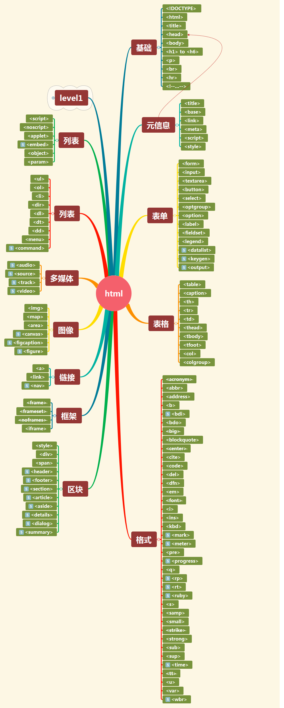

# HTML

# 1. HTML介绍

## 1.1. 什么是HTML

- HTML:  Hyper Text Markup Language(**超文本**标记**语言**)

- 超文本: 不仅仅有文本，还有图片、链接、甚至还有音频和视频等

- 标记语言 : 是一种将文本和文本组合起来，展示**文档结构**和**数据格式**的符号编码，简单的可以看成`<标记>`，

  也称标签 

## 1.2. 特征

- 它是一门独立的语言，属于网页的语言
- 它不属于编程语言，而是标记语言
- 它经历三个阶段
  - 第一阶段: web1.0，以内容为主，主流技术HTML+CSS
  - 第二阶段: web2.0 ，以ajax为主, 主流技术是JavaScript、DOM和异步请求
  - 第三阶段 : web3.0，以HTML5+CSS3，使互联网进入新时代

## 1.3. 三个组织

- W3C	  :(world wide web Consortium :万维网联盟)，它是HTML官方组织，负责各个HTML版本规范，目前在完善HTML5的规范。
- WHATWG : 网页超文本应用技术工作组，各大浏览器厂商的人员组成的。成立于2004年。
- IETF          : 因特网工作任务组，负责开发网络协议

## 1.4. 发展历史

- 1989年，tim提出web的原型。纯文本、静态的、链接。
- 1993年，mark（大学生），加入图片。
- 1993年，IETF发布html1.0草案。
- 1994年，tim牵头成立了w3c。
- 1995年，html第一个正式版： html2.0。
- 1996年 ，html3.2
- 1997年，html4.0
- 1999年，html4.0.1
- 2000年，xhtml1.0
- 2001年，xhtml1.1
- 2013年，html5.0


## 1.5. 4.0至5.0 的艰难历史

- HTML最早是1995年从2.0开始的，实际上没有正式版的HTML1.0的官方规范。第一个HTML2.0的出现与规范不是出自w3c，而是由IETF制定的。到HTML2.0版本后版本才由W3C接手负责后续版本规范的制定

- 1996~1999时，HTML的版本由3.2到4.0，再由4.0变成4.0.1 ，经历了非常块的发展。问题是到了4.01后有了分歧

- 在2000年，W3C认识发生了改变 ，提出了XHTML1.0概念

- 在2001年，推出版本XHTML1.1,把文档变成XML方式。

- XHTMl存在一些问题

  - 把文档变成XML后，IE浏览器不能处理，当然8以上已经可以处理。
  - XML的语法很严格，如果整个页面有一个小错误，会导致正个页面都不显示。
  - 想继续推XHTML2.0，这个版本没有出现

- 2004年，W3C召开会议，琢磨着改良，当时讨论的话题就是继续发展XHTML2.0还是沿着之前HTML4.01方

  向，当时W3C仍然认为XHTML2.0是主注方向，投票否决了沿着HTML4.01方向继续发展的建议。由Opera为

  代表的浏览器厂商提出来，我们各个浏览厂商组织WHTAWG来沿着HTML4.01继续发展，之后WHTAWG发展

  很快，收益很多，而W3C的XHTML2.0仍然没有实质性进展

- 2006年，W3C召开会议，进行反思，重回HTML方向

- 2007年W3C投票通正式转向HTML方向，在WHTAWG上组建HTML5专家组

# 2. 第一个HTML

```html
<!--
    html根标签
    head子标签，定义文档的基本信息。（编码、标签）
    body子标签，定义文档的正文内容。（文本、图片、表格、表单、音视频...）
    标签由<>组成
    标签一般是成对出现的，有开有结。有此没有关闭，比如meta
    标签是可以嵌套的,要注意正确的嵌套
    标签后的内容称为属性，属性一般由属性名称属性值组成，之间用“=”相连，同时注意属性值必须加上""或''号；如果有多个属性，之前用" "隔开
    注释: <!-- -- >
    在根标签的上面，可以写上文档类型声明
    !或html:5 + tab
    html:xt
    html:xs:
    html:xxs:
-->
<html>
    <head>
        <meta charset="utf-8" >
        <title>第一个网页</title>
    </head>
    <body>
        好好学习
        天天向上
    </body>
</html>
```


# 3. head标签中的子标签

## 3.1. meta标签

- 设置编码格式 

```html
 <meta charset="UTF-8">
  or 
 <meta http-equiv="Content-Type" content="text/html;charset=UTF-8">
```

- 设置名称和内容

  ```html
  <!-- 关键字-->
  <meta name="keywords" content="k1,k2">
  <!-- 描述-->
  <meta name="description" content="desc">
  <!-- 作者-->
  <meta name="author" content="xx">
  ```

- 设置刷新，能守设置http-equiv

```html
<meta http-equiv="refresh" content="2"> <!--单位为秒-->
```

## 3.2. title标签 

- 设置页面标签，一个页面一个标题。

```html
<title>第一个网页</title>
```

## 3.3. base标签 

- 基于什么目录 ，一般设置站点的根目录 

```html
<!DOCTYPE html>
<html lang="en">
<head>
    <meta charset="UTF-8">
    <title>base的秒用</title>
    <!--
        base是链接基于这个路径 
        /是相当web服务器的根目录 
        /01_day_html/:web服务器的根目录下的01_day_html的站点目录
    -->
    <base href="/01_day_html/">
</head>
<body>


</body>
</html>
```

## 3.4. link标签 

- 引入样式(后面讲)

## 3.5. style标签

- 声明样式(后面讲)

## 3.6. script标签

- 声明脚本(后面讲)

# 4. body的内容



## 4.1.  标题标签

- `<h1>~<h6>` 从大到小，字体加粗，独占一行(块级元素)

- 写成其它，如`<h7></h7>`不报错，只不过没有效果。默认大写与h4差不多，只不过不加粗。

- 语义:表示标题。`<h1></h1>`权重最高，一般一个页面就一个。

- 示例

  ```html
  <!--标题标签-->
  <h1>1111</h1>
  <h2>2222</h2>
  <h3>3333</h3>
  <h4>4444</h4>
  <h5>5555</h5>
  <h6>6666</h6>
  <!--无效-->
  <h7>7777</h7>
  99999
  88888
  ```

## 4.2. 段落

- 表示一个段整体的部分，如一篇文章的某一段落。用标签` <p></p>`表示 

  ```html
  <h2>段落</h2>
  <p>p11111111</p>
  <p>p22222222</p>
  <p>p33333333</p>
  ```

## 4.3. 换行 

- 表示内容的换行，用标签`<br>`表示

  ```html
  <h2>换行</h2>
  h1111111111111 <br>
  h2222222222222 <br>
  h3333333333333 <br>
  ```

## 4.4. 水平线

- 即水平的一条线，用标签`<hr>`表示 

## 4.5. 列表

- 无序列表

  - ul  :  unorder list

    - li : list item

  - 属性

    - type: disc|circle|square

  - 示例

    ```html
    <h2>无序列表</h2>
    <ul  type="disc">
        <li>aaa</li>
        <li>bbb</li>
        <li>ccc</li>
    </ul>
    <ul type="circle">
        <li>aaa</li>
        <li>bbb</li>
        <li>ccc</li>
    </ul>
    <ul type="square">
        <li>aaa</li>
        <li>bbb</li>
        <li>ccc</li>
    </ul>
    ```

- 有序列表

  - ol: order list

    - li : list item

  - 属性

    - type: 1 | a|A |i |I
    - start: 数字

  - 示例

    ```html
    <h2>有序列表</h2>
    <ol type="1">
        <li>o111</li>
        <li>o111</li>
        <li>o111</li>
    </ol>
    
    <ol type="a">
        <li>o111</li>
        <li>o111</li>
        <li>o111</li>
    </ol>
    <ol type="A">
        <li>o111</li>
        <li>o111</li>
        <li>o111</li>
    </ol>
    <ol type="i" start="3">
        <li>o111</li>
        <li>o111</li>
        <li>o111</li>
    </ol>
    <ol type="I">
        <li>o111</li>
        <li>o111</li>
        <li>o111</li>
    </ol>
    ```

- 定义列表

  - 自定义的一组列表，分为dl标签(定义列表)，dt标签（定义标签），dd标签（定义描述标签）

  - 示例

    ```html
    <h2>定义列表</h2>
        <dl>
            <dt>标题</dt>
            <dd>描述1</dd>
            <dd>描述2</dd>
            <dt>标题</dt>
            <dd>描述1</dd>
            <dd>描述2</dd>
        </dl>
    ```

- 嵌套列表 

  - 有序列表和无序列表之间可以相互嵌套，注意嵌套层次
  - 示例

  ```html
  <h2>嵌套列表</h2>
      <!--ol>li*3>{00$}-->
      <ol>
          <li>001</li>
          <li>002</li>
          <li>003</li>
          <ol>
              <li>a</li>
              <li>a</li>
              <li>a</li>
              <ul>
                  <li>b</li>
                  <li>b</li>
                  <li>b</li>
              </ul>
          </ol>
      </ol>
  
      <ul>
          <li>a</li>
          <li>a</li>
          <li>a</li>
          <ul>
              <li>b</li>
              <li>b</li>
              <li>b</li>
              <ul>
                  <li>c</li>
                  <li>c</li>
                  <li>c</li>
              </ul>
          </ul>
      </ul>
  ```

## 4.6. 链接

- 链接到外部网址

  ```html
  <a href="http://www.wanho.net">wanho</a>
  ```

- 链接到内部网址

  ```html
  <a href="03_body.html">03_html</a>
  ```

- 链接到邮箱

  ```html
  <a href="mailto:xxx@xx.xx">邮箱</a>
  ```

- 链接到当前网址的不同部分

  ```html
  <a href="#锚点名">跳转到某个锚点</a>
  定义锚点
  <a name="锚点名">跳转的内容</a>
  ```

- 链接到外部网址的不同部分

  ```html
  <a href="http://www.wanho.net#first">wanho</a>
  <a href="03_body.html#first">wanho</a>
  ```

- 属性

  - target
    - _self 默认 ,在当前页面打开链接
    - _blank，在新的标签页面打开链接

- 示例

  ```html
  <h2>链接到外部网址</h2>
      <a href="http://baidu.com" target="_self">百度_self</a>
      <a href="http://baidu.com" target="_blank">百度_blank</a>
      <hr>
  
      <h2>链接到邮箱（邮箱的客户端）</h2>
      <a href="mailto:89115008@qq.com">我的邮箱</a>
      <hr>
  
      <h2>链接到同一个网站不同部分</h2>
      <a href="#history">历史</a> | <a href="#love">爱情</a> |<a href="#xuan">玄幻</a> |<a href="#ke">科技</a>
      <p style="height: 500px">
          <a name="history">历史小说</a>
  
      </p>
      <p style="height: 500px">
          <a name="love">爱情小说</a></p>
      <p style="height: 500px">
          <a name="xuan">玄幻小说</a></p>
      <p style="height: 1000px">
          <a name="ke">科技小说</a></p>
  
      <hr>
  
      <h2>链接到外部网址的不同部分</h2>
      <a href="03_body.html#abc">03的abc部分</a>
  ```


## 4.7. 图片

- 用来显示图片的，使用``标签

- 属性

  - src	图片源
  - alt   当图片不存在的时候显示的文本
  - width 宽度，单位用px
  - height 高度，单位用px
  - border 边框，单位用px

- 示例

  ```html
  <h2>图片</h2>
  
  ```

## 4.8.  表格 : 用于数据的布局呈现

- 表格是由行和列组成的，用`<table></table>`标签来表示

- 属性

  - width
  - height
  - border
  - align: left|right|center

- 子标签

  - `<caption></caption>` 表格标题
  - `<tr></tr>`表格行
  - `<td></td>`表格数据，可以理解列
  - `<th></th>`表格头部，可以理解列标题，比列多了加粗且居中

- 示例

  ```html
  <h2>表格</h2>
  <!--table>tr*3>td*2-->
  <table width="60%" border="1" align="center">
      <caption>学生信息表</caption>
      <tr>
          <th>学号</th>
          <th>姓名</th>
      </tr>
      <tr>
          <td>1001</td>
          <td>张三</td>
      </tr>
      <tr>
          <td>1002</td>
          <td>李四</td>
      </tr>
  </table>
  ```

## 4.9.  表单 : 用于不同页面的数据传递

- 表单用标签`<form></form>`来表示
- 属性
  - action:表示要提交到的页面
  - method:提交数据的方式
    - get:   在地址栏中提交数据
    - post: 在表单中提交数据
    - 优缺点
      - 相同点
        - 都能提交表单数据
      - 不同点
        - get:   在地址栏中提交数据而post: 在表单中提交数据
        - get安全性不高，post相对较高
        - 地址栏中传值是有大小限制的最多255个字符，而表单传递没有限制
        - 推荐使用post的方式，只有作书签用途时候才会用get。

- 表单元素
  - 标签 ： `<label for="id的名称"></label>`
  - 文本框 : `<input type="text">`
  - 密码框 : `<input type="password">`
  - 单选 : `<input type="radio" value=""  checked>呈现值`
  - 复选框 : `<input type="checkbox" value="" checked>呈现值`
  - 下拉框 : `<select><option value="" selected>呈现值</option>...</select>`
  - 列表框 : `<select multiple><option value="" selected>呈现值</option>...</select>` 
  - 文值 : `<file>`
  - 隐藏域 : `<input type="hidden">`
  - 文本域 : `<textarea rols="20" cols="50"></textarea>`
  - 按钮: `<input type="submit" value="提交"><input type="reset" value="重置"><input type="button" value="按钮">`
- 行列合并
  - 行合并 rowspan=""
  - 列合并 colspan=""

- 表单示例

```html
<h2>表单的学习</h2>
<form action="01_html入门.html" method="get">

    <!--table[width="60%"][align="center"]>tr*9>td*2-->
    <table width="60%" align="center" border="0">
        <caption>用户注册</caption>
        <tr>
            <td> <!--标签-->
                <label for="txtName">用户名:</label></td>
            <td> <!--input标签 ：文本框-->
                <input  type="hidden" name="id" value="1001">
                <input type="text" id="txtName" name="txtName" value="张三"/></td>
        </tr>
        <tr>
            <td>
                <label for="pwd">密码:</label>
            </td>
            <td>
                <input type="password" id="pwd" name="pwd">
            </td>
        </tr>
        <tr>
            <td>
                <label for="gender">性别:</label>
            </td>
            <td>
                <input type="radio" id="gender" name="gender" value="male">男
                <input type="radio"  name="gender" checked value="female">女
            </td>
        </tr>
        <tr>
            <td>
                <label for="hobby">爱好</label>
            </td>
            <td>
                <input type="checkbox" id="hobby" name="hobby" value="travel">旅游
                <input type="checkbox"  name="hobby" value="music">音乐
                <input type="checkbox"  name="hobby" checked value="reading">读书
                <input type="checkbox"  name="hobby" value="swim">游泳
            </td>
        </tr>
        <tr>
            <td>
                <label for="birthday">出生年</label>
            </td>
            <td>
                <select name="birthday" id="birthday">
                    <option value="1990">1990</option>
                    <option value="1991">1991</option>
                    <option value="1993">1993</option>
                    <option value="1994">1994</option>
                    <option value="1995" selected>1995</option>
                </select>
            </td>
        </tr>
        <tr>
            <td>
                <label for="lovecity">向往的城市</label>
            </td>
            <td>
                <select name="lovecity" id="lovecity" multiple>
                    <option value="nanjing">南京</option>
                    <option value="suzhou">苏州</option>
                    <option value="wuxi">无锡</option>
                    <option value="changzhou">常州</option>
                </select>
            </td>
        </tr>
        <tr>
            <td>
                <label for="photo"> 头像</label>
            </td>
            <td>
                <input type="file" id="photo" name="photo">
            </td>
        </tr>
        <tr>
            <td>
                <label for="info">自我介绍</label>
            </td>
            <td>
                <textarea name="info" id="info" cols="50" rows="10"></textarea>
            </td>
        </tr>
        <tr>
            <td>
                <input type="submit" value="提交">
            </td>
            <td>
                <input type="button" value="普通按钮">
                <input type="reset" value="重置">
            </td>
        </tr>
    </table>
</form>
```

- 合并示例

```html
<h2>行列合并</h2>
<table width="50%" border="1px">
    <tr>
        <td rowspan="3">一季度</td>
        <td>1月</td>
    </tr>
    <tr>
        <td>2月</td>
    </tr>
    <tr>
        <td>3月</td>
    </tr>
    <tr>
        <td rowspan="3">二季度</td>
        <td>4月</td>
    </tr>
    <tr>
        <td>5月</td>
    </tr>
    <tr>
        <td>6月</td>
    </tr>
    <tr>
        <td colspan="2" align="center">汇总</td>
    </tr>
</table>
```

## 4.10. 实体

HTML 实体指的就是 HTML 的转移字符。

| 显示结果 | 描述              | 实体名称   |
| -------- | ----------------- | ---------- |
| '        | 单引号            | `&apos;`   |
|          | 空格              | `&nbsp;`   |
| <        | 小于号            | `&lt;`     |
| >        | 大于号            | `&gt;`     |
| &        | 和号              | `&amp;`    |
| "        | 引号              | `&quot;`   |
| ©        | 版权（copyright） | `&copy;`   |
| ®        | 注册商标          | `&reg;`    |
| ™        | 商标              | `&trade;`  |
| ×        | 乘号              | `&times;`  |
| ÷        | 除号              | `&divide;` |

- 示例

```html
 空格:&nbsp;&nbsp;&nbsp;a <br>
    小于: &lt; <br>
    大于: &gt; <br>
    双引号: &quot; <br>
    单引号: &apos; <br>
    版权符: &copy; <br>
    注册符: &reg; <br>
```

# 5. 框架 frame

## 5.1.  框架集  frameset，在html5中已经不推荐。

- top.html

  ```html
  <!DOCTYPE html>
  <html lang="en">
  <head>
      <meta charset="UTF-8">
      <title>Title</title>
  </head>
  <body>
  <h1 align="center">xxx公司欢迎您...</h1>
  
  </body>
  </html>
  ```

- left.html

  ```html
  <!DOCTYPE html>
  <html lang="en">
  <head>
      <meta charset="UTF-8">
      <title>Title</title>
  </head>
  <body>
  <p><a href="info.html" target="rightFrame">公司简介</a></p>
  <p><a href="product.html" target="rightFrame">公司产品</a></p>
  <p><a href="culture.html" target="rightFrame">公司文化</a></p>
  <p><a href="link.html" target="rightFrame">友情链接</a></p>
  </body>
  </html>
  ```

- info.html

  ```html
  <!DOCTYPE html>
  <html lang="en">
  <head>
      <meta charset="UTF-8">
      <title>Title</title>
  </head>
  <body>
  公司有这些简介...
  </body>
  </html>
  ```

- product.html

  ```html
  <!DOCTYPE html>
  <html lang="en">
  <head>
      <meta charset="UTF-8">
      <title>Title</title>
  </head>
  <body>
      公司有这些产品...
  </body>
  </html>
  ```

- culture.html

  ```html
  <!DOCTYPE html>
  <html lang="en">
  <head>
      <meta charset="UTF-8">
      <title>Title</title>
  </head>
  <body>
  公司有这些文化...
  </body>
  </html>
  ```

- link.html

  ```html
  <!DOCTYPE html>
  <html lang="en">
  <head>
      <meta charset="UTF-8">
      <title>Title</title>
  </head>
  <body>
  <a href="#">链接1</a><br>
  <a href="#">链接1</a><br>
  <a href="">链接1</a> <br>
  </body>
  </html>
  ```

- frameset.html , 注解框架集中不能出现body标签

  ```html
  <!DOCTYPE html PUBLIC "-//W3C//DTD XHTML 1.0 Transitional//EN"
          "http://www.w3.org/TR/xhtml1/DTD/xhtml1-transitional.dtd">
  <html xmlns="http://www.w3.org/1999/xhtml" xml:lang="en">
  <head>
      <meta http-equiv="Content-Type" content="text/html;charset=UTF-8">
      <title>Document</title>
  </head>
  <frameset rows="20%,*">
      <frame src="top.html">
  
      <frameset cols="20%,*">
          <frame src="left.html">
          <frame src="info.html" name="rightFrame">
      </frameset>
  </frameset>
  
  
  </html>
  ```

## 5.2.  内联框架  iframe

- top.html

  ```html
  <!DOCTYPE html>
  <html lang="en">
  <head>
      <meta charset="UTF-8">
      <title>Title</title>
  </head>
  <body>
  <h1 align="center">xxx公司欢迎您...</h1>
  
  </body>
  </html>
  ```

- left.html

  ```html
  <!DOCTYPE html>
  <html lang="en">
  <head>
      <meta charset="UTF-8">
      <title>Title</title>
  </head>
  <body>
  <p><a href="info.html" target="rightFrame">公司简介</a></p>
  <p><a href="product.html" target="rightFrame">公司产品</a></p>
  <p><a href="culture.html" target="rightFrame">公司文化</a></p>
  <p><a href="link.html" target="rightFrame">友情链接</a></p>
  </body>
  </html>
  ```

- product.html

  ```html
  <!DOCTYPE html>
  <html lang="en">
  <head>
      <meta charset="UTF-8">
      <title>Title</title>
  </head>
  <body>
  <iframe src="top.html" frameborder="0"></iframe>
  <br>
  <iframe src="left.html" frameborder="0"></iframe>
  <br>
  新产品欢迎你....
  </body>
  </html>
  ```
