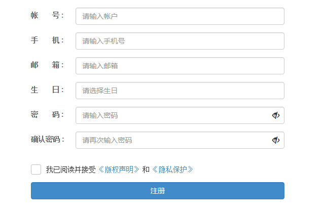

# ECMAScript 

# 1. JavaScript 

## 1.1. 简介

- JavaScript是由网景(Net Scape)公司创建的，最早Livescript，当时名气不大，蹭java热度才改名。其实跟Java

  没有任何关系 。

- 它果一个脚本语言，它要依赖于HTML或浏览器引擎（chrome-v8）。

- v8引擎单独抽取到服务器，这个环境称nodejs

- JS不能单独运行。

## 1.2. 作用

- 页面物效
- 表单验证

## 1.3. ECMAScript和JavaScript

- 1995推出了Livescript，改名JavaScript
- 1996 微软推出了JScript
- 1997Net Scape向 ECMA(欧洲计算机制造商协会)提交脚本语法的范围申请。想把JavaScript作为标准规范。官方推出的规范标准为ECMAScript，而JavaScript和JScript都为其实现。
- 现在一般认为 ECMAScript即为JavaScript，最新版本已经到ES7.0

## 1.4. JavaScript组成

- ECMAScript:
  - 语法 
  - 类型
  - 变量
  - 分支
  - 循环
- BOM:浏览器对象模型
- DOM:文档对象模型

# 2. 第一个JavaScript

```html
<!DOCTYPE html>
<html lang="en">
<head>
    <meta charset="UTF-8">
    <title>js入门</title>
    <!--页面的js脚本-->
    <script type="text/javascript" language="JavaScript">
        // chrome里特有输出诫勉
        console.log("hello","world","love you ");
        /*
            输出 hello world
        */
        document.writeln("Hello <br>");
        document.write("World");
    </script>
</head>
<body>

</body>
</html>
```

# 3. JavaScript的三种范围

- 行内

- 页面

- 站点

- 示例

  - js

  ```javascript
  // chrome里特有输出诫勉
  console.log("hello", "world", "love you ");
  /*
      输出 hello world
  */
  document.writeln("Hello <br>");
  document.write("World");
  ```

  - html

```html
<!DOCTYPE html>
<html lang="en">
<head>
    <meta charset="UTF-8">
    <title>js入门2</title>
    <!--站点js，通过script引入进来-->
    <script language="JavaScript" type="text/javascript" src="js/main.js"></script>
    <!--页面-->
    <script>
        document.write("你好，世界");
    </script>
</head>
<body>
        <!--行内js-->
        <button onclick="alert('警告框')">点我</button>
        <a href="javascript:alert('警告框2')">点我2</a>
</body>
</html>
```

# 4. 标识符：取名字的地方

- 包含字母、数字、$和下划线
- 开头只能是字母、$和下划线
- 区分大小写
- 见名识义

# 5. 数据类型


-  原始类型
  - boolean : true | false
  - number : 整数|小数|NaN
  - string : " "|'  '
- 包装类型
  - Boolean:
  - Number:
  - String:
- 引用类型
  - Date
  - Array
  - RegExp
- 特殊类型
  - undefined
  - null
- 示例

```html
<!DOCTYPE html>
<html lang="en">
<head>
    <meta charset="UTF-8">
    <title>datatye</title>
    <script type="text/javascript" language="JavaScript">
        //boolean: true|false
        var a = false;
        var b = true;
        document.write(a+"<br>"); //false
        document.write(b+"<br>"); //true
        var c =  new Boolean(-10); //true
        var d = new Boolean(0); //false
        document.write(c+"<br>"); //false
        document.write(d+"<br>"); //true
        var e = new Boolean(NaN).valueOf(); //
        document.write(e+"<br>"); //false

        //number
        var n1 = 1;
        document.write(n1+"<br>"); //1
        var n2 = 1.5;
        document.write(n2+"<br>"); //1.5
        var n =  new Number('a').valueOf();
        document.write(n+"<br>"); //NaN

        //string
        var s1 ='abc';
        document.write(s1+"<br>"); //abc
        var s2="123";
        document.write(s2+"<br>"); //123
        var s3="1\\2\n3\'\"";
        document.write(s3+"<br>"); //1\23

        //验证类型 typeof()
        document.write(typeof(a)+"<br>");
        document.write(typeof(e)+"<br>");
        document.write(typeof(n1)+"<br>");
        document.write(typeof(n)+"<br>");
        document.write(typeof(s3)+"<br>");


        //特殊类型 undefined| null
        var o ;
        document.write(o+"<br>"); //如果变量未赋值，则输undefined
        document.write(typeof(o)+"<br>"); //undefined

        var o2 = null;
        document.write(o2+"<br>"); //null
        document.write(typeof(o2)+"<br>");
        document.write("<br>");
        document.write("<br>");
        document.write("<br>");


    </script>
</head>
<body>

</body>
</html>
```


# 6. 变量

- 在JavaScript中，变量是弱类型（在运行的时候获取类型，声明不需要指定类型）

- 语法:

  ```javascript
  var 变量名=值;
  //在javascript中变量，在使用之前可以不初始，则值为undefined
  
  //甚至在javascript中变量声明时可以不加var;则声明是全局变量，加上var则声明局部变量
  ```

- 示例

  ```html
  <!DOCTYPE html>
  <html lang="en">
  <head>
      <meta charset="UTF-8">
      <title>variable</title>
      <script language="JavaScript" type="text/javascript">
          //声明变量 var 变量名=值;  在赋值之后确认类型，没有值，则为undefined类型
          //var num = 100;
          //num = 10; 声明时没有加上var，则是全局变量，尽量少用，占空间且容易冲突
          function show()
          {
              var n = 100; //外面不可访问
              num = 10; //外面可以访问
          }
          show();
          //document.write(n+"<br>");
          document.write(num+"<br>");
      </script>
  </head>
  <body>
  
  </body>
  </html>
  ```

# 7. 运算符

## 7.1. 算术运算符

```javascript
++ --
* / % 
+  -
```

## 7.2. 关系运算符

```javascript
> >= < <= 
== != ===  !==
isNaN()
```

## 7.3. 逻辑运算符

```javascript
!
&&
||
```

## 7.4. 赋值运算符

```javascript
*= /= %=
+= -=   = 
```


## 7.5. 三元运算符

```javascript
条件?值1:值2
```

- 示例

```html
<!DOCTYPE html>
<html lang="en">
<head>
    <meta charset="UTF-8">
    <title>运算符</title>
    <script type="text/javascript" language="JavaScript">
        //算术
        var i=5;
        var j=6;
        document.write( i++ +"<br>"); //5
        document.write(++i + "<br>"); //7
        document.write( i++ + --j + "<br>"); //12
        document.write( i/j +"<br>"); //1.6
        document.write(i%j+"<br>");

        //关系
        document.write((5>3)+"<br>");
        document.write((5>=3)+"<br>");
        document.write((5=='5')+"<br>"); //==比的值相等
        document.write((5==='5')+"<br>"); //==比的值相等且类型相等
        document.write((5!='5')+"<br>"); //== 值不相等返回true，其它是false
        document.write((5!=='a')+"<br>"); //!== 值相等且类型相等返回false，其它都是true

        //逻辑
        document.write(!false+"<br>"); //true
        document.write(!2+"<br>"); //false
        document.write(  (2 && true) +"<br>");//true
        document.write((true || 2) +"<br>"); //true
        document.write(!NaN+"<br>");//true
        document.write( (true ||j++)+"<br>");
        document.write(j+"<br>");


        //赋值
        j%=3;
        document.write(j+"<br>");

        //三元
        document.write((5>2)?true:false+"<br>");

    </script>
</head>
<body>

</body>
</html>
```

## 7.6. 优先级

- ()
- 算术
- 关系 
- 逻辑
- 赋值

# 8. 流程语句 

## 8.1. 默认流程

- 从上往下
- 从左至右： 赋值除外，它是从右往左进行赋值

## 8.2. 分支流程

- if

  - 简单if
  - if-else
  - 多重if
  - 嵌套if

- switch-case

  swtich(表达式){

  	case 值1: 表达式1;break;
		
  	case 值2: 表达式2;break;
		
  	default:其它表达式;break;

  }

  表达式返回值的类型，可以是number,string

## 8.3. 循环流程

- while
  - 先判断再执行
- do-while
  - 先执行再判断 
  - 如果开始条件为真,while和do-while没有区别，如果开始条件为false,do-while至少比while多执行一次
- for
- break
  - 结束当前循环
- continue
  - 结束本次循环，继续下次循环

## 8.4. 示例

```html
<!DOCTYPE html>
<html lang="en">
<head>
    <meta charset="UTF-8">
    <title>流程语法</title>
    <script language="JavaScript" type="text/javascript">

        //默认流程：从上班下，从左至右
        document.write("第一行语句 <br>");
        document.write("第二行语句<br>");

        //分支结构
        //简单if
        if(true){
            document.write("确认"+"<br>");
        }
        //if-else
        if(false){
            document.write("正确"+"<br>");
        }else{
            document.write("不正确"+"<br>");
        }

        //多重if
        var score=90;
        if(score>=90){
            document.write("A<br>");
        }else if(score>=80){
            document.write("B<br>");
        }else{
            document.write("C<br>");
        }

        //嵌套if
        var gao=true,fu=true,shuai=false,flag=false;
        if(gao==true){
            if(fu==true){
                if(shuai==true){
                    document.write("marry to you ");
                    flag=true;
                }
            }
        }
        if(flag==false){
            document.write("gun<br>");
        }

        //swtich-case
        var ch ='A';
        switch(ch){
            case 'A':  document.write("90以上<br>");break;
            case 'B':  document.write("90以上<br>");break;
            default :  document.write("其它内容<br>");break;
        }

        //循环
        //while
        var i=0;
        while(i<5){
            document.write("i love you<br>");
            i++;
        }
        //do-while
        i=0;
        document.write("<hr>");
        do{
            document.write("i love you<br>");
            i++;
        }while(i<5);
        document.write("<hr>");
        //for
        for(var j=0;j<5;j++){
            document.write("i love you<br>");
        }
        document.write("<hr>");
        //break和continue
        for(var j=0;j<100;j++){
            if(j%5==0){
                continue;
            }
            document.write(j+"&nbsp;&nbsp;&nbsp;");
            if(j==29){
                break;
            }
        }
        document.write("<br>");
        document.write("<br>");

    </script>
</head>
<body>
</body>
</html>
```

# 9. 函数及语法

- 函数可以理解成java中的方法

- 定义函数和调用函数，如果不调用函数，函数中的内容是不会执行的

- 定义语法

  ```javascript
  function 函数名(参数名1，参数名2){
      函数体;
      [return 值1];
  }
  ```

- 调用语法

  ```javascript
  var 返回值 = 函数名(参数值1，参数值2);
  //调用的时候，函数名和参数列表要一致
  ```

## 9.1. 特殊用法 

-  先声明再调用 
- 声明时同时调用 
- 声明匿名函数同时调用 
- 声明函数变量再调用 
- 内部函数
- 回调函数
- 没重载函数的概念，后边的同名函数会把前面的覆盖，调用时参数数量不一致，也可以调用
- 作为返回值的函数

```html
<!DOCTYPE html>
<html lang="en">
<head>
    <meta charset="UTF-8">
    <title>匿名函数、自调用函数</title>
    <script language="JavaScript" type="text/javascript">
        //声明函数
        function show() {
            document.write("show<br>");
        }
        //调用函数
        show();

        //声明函数同时调用
        (function show2(){
            document.write("show<br>");
        })();

        //声明函数同时调用，不需要名字
        (function (){
            document.write("show<br>");
        })();

        //声明函数赋值给变量
        var fn =  function show() {
            document.write("show<br>");
        };
        // document.write(typeof(fn)+"<br>");
        //调用函数
        fn();
        
        //外部函数中可以声明内部函数
        function outer(){
            document.write("外部函数<br>");
            //局部函数
            function inner(){
                document.write("内部函数<br>");
            }
            //调用内部函数
            inner();
        }
        outer();
        
       //回调函数:参数是一个函数
        function add(fn,b){
            return fn()+b;
        }
        document.write( add(function(){return 1},2)+"<br>");

        //示例：回头再调，即为回调函数
        var successFn = function success(){
            //登录成功要做事情
        };
        var errorFn = function success(){
            //登录失败要做事情
        };
        ajax("a.html","uname=zsf&upass=123",successFn,errorFn);
        function ajax(url,param,fn){
            //跳转到url页面
            //jump(url),
            //获取用户和密码
            //paraseParam()
            {
                successFn(); //or
                errorFn();
            }
        }
        
         //在javascript中函数没重载的概念，后边的函数会把前面的覆盖
        function caculator(){
            document.write("空<br>");
        }
        function caculator(i,j){
            document.write(''+i+j+"2个参<br>");
        }
        caculator(1,2,3);
        
          //作返回值的函数
        function showResult(){
            return ((function(){
                return "函数的返回的结果"
            })());
        }
        document.write(showResult()+"<br>");

    </script>
</head>
<body>

</body>
</html>
```

## 9.2. 作用域

### 9.2.1.  变量作用域

- 全局变量:能被当前文件档中其它代码访问
  - 在所有函数外部声明的变量称为全局变量
  - 声明变量时不加var，即使在函数内也为全局变量
- 局部变量：只能在该函数内进行访问

  - 在函数内容声明的变量

- 示例

  ```javascript
  <!doctype html>
  <html lang="en">
  <head>
      <meta charset="UTF-8">
      <meta name="viewport"
            content="width=device-width, user-scalable=no, initial-scale=1.0, maximum-scale=1.0, minimum-scale=1.0">
      <meta http-equiv="X-UA-Compatible" content="ie=edge">
      <title>函数</title>
      <script type="text/javascript" language="JavaScript">
          //定义函数
          function add(num1,num2){
              return (num1+num2);
          }
          //调用函数
          document.write( add(4,5)+"<br>");
  
          //作用域
          // 变量的作用域
          var msg="wanho" //全局变量（在所有函数外声明的变量）
          document.write( msg+"<br>");
  
          // 匿名函数，自调用
          (function(){
              msg2="ITTec"; //全局变量，因为前面声明时没有加上var
          })();
  
          // 局部变量,它的使用域只能在访函数内使用
          (function(){
              var localVar="local";
              document.write(localVar+"1<br>");
          })();
  
          function show(){
              document.write(msg+"<br>");
              document.write(msg2+"<br>");
              // document.write(localVar+"2<br>");//局部变量访问不到
          }
          show();
  
  
          document.write("<br>");
      </script>
  </head>
  <body>
  
  </body>
  </html>
  ```

#### 9.2.1.1.  声明提前

- 全局变量和局变量都必须先声明再使用，否则它的值为undefined

```html
<!DOCTYPE html>
<html lang="en">
<head>
    <meta charset="UTF-8">
    <title>Title</title>
    <script type="text/javascript" language="JavaScript">
        //全局变量
        document.write(age+"<br>"); // undefined
        var age=18;
        document.write(age+"<br>"); //18

        //局部变量
        function fn(){
            document.write(name2+"<br>"); //undefined
            var name2="lsg";
            document.write(name2+"<br>"); //zsf
        }
        fn();
    </script>
</head>
<body>

</body>
</html>
```

#### 9.2.1.2. 原始类型的传递，为值传递

```html
<!doctype html>
<html lang="en">
<head>
    <meta charset="UTF-8">
    <meta name="viewport"
          content="width=device-width, user-scalable=no, initial-scale=1.0, maximum-scale=1.0, minimum-scale=1.0">
    <meta http-equiv="X-UA-Compatible" content="ie=edge">
    <title>函数</title>
    <script type="text/javascript" language="JavaScript">


        //值传递
        var n = 100;
        document.write(n+"<br>"); // 100
        change(n);
        document.write(n+"<br>"); // 100

        function change(n){
            n=10; //10
        }

    </script>
</head>
<body>

</body>
</html>
```

#### 9.2.1.3. 局部变量不是你理解的那样

- es6之前在javascript语句块中没有局部变量的概念，只有在函数中才有局部变量的概念，es6及之后可以通过

  let声明的方式来实现在语句块中声明局部变量

```html
<!doctype html>
<html lang="en">
<head>
    <meta charset="UTF-8">
    <meta name="viewport"
          content="width=device-width, user-scalable=no, initial-scale=1.0, maximum-scale=1.0, minimum-scale=1.0">
    <meta http-equiv="X-UA-Compatible" content="ie=edge">
    <title>函数</title>
    <script type="text/javascript" language="JavaScript">
        //es6之前在javascript语句块中没有局部变量的概念，只有在函数中才有局部变量的概念
        {
            var  con="连接";
        }
        //document.write(con+"<br>"); //连接 可以访问

        //循环
        for(var i=0;i<5;i++){

        }
        document.write(i+"<br>"); //5   可以访问
    </script>
</head>
<body>

</body>
</html>
```

### 9.2.2.  函数作用域

- 函数与变量一样，也分全局函数和局部数，在

- 全局函数，在`<script>`标签下声明的函数即为全局函数
- 局部函数，在函数的里边声明的函数称为局部函数

```html
<!DOCTYPE html>
<html lang="en">
<head>
    <meta charset="UTF-8">
    <title>函数作用域 </title>
    <script type="text/javascript" language="JavaScript">

        //全局函数
        function add(num1,num2){
            document.write(num1+num2+"<br>");
        }
        add(1,2);


        function outer(){
            document.write("外部函数<br>");
            //局部函数
            function inner(){
                document.write("内部函数<br>");
            }
            //调用内部函数
            inner();
        }
        outer();
        // inner(); 访问不到
    </script>
</head>
<body>

</body>
</html>
```

## 9.3. 闭包

- 在很多语言中有块级作用域，在javascript中没有块级作用域。
- 在函数中有使用域的概念，推荐在函数中声明变量，才为真正的局部变量。
- 还可以在函数中再声明函数，此函数为局部函数。一般是为暴露局部变量。有点类似于java中的get和set方法。这个暴露的功能称为闭包功能。

```html
<!DOCTYPE html>
<html lang="en">
<head>
    <meta charset="UTF-8">
    <title>闭包</title>
    <script language="JavaScript" type="text/javascript">
        var b;
        function f(){
            var a = 'a';
            //闭包
            b = function(){
              return a+"b";
            };
            return a;
        }
        document.write(f()+"<br>"); //a
        document.write(b()+"<br>");//ab

        document.write("<hr>");
        function fn(){
            var num = 100;

            //闭包
            return function(){
                return num;
            }
        }
        document.write(fn()()+"<br>"); //100

        document.write("<hr>");

        var getId,setId;
        (function student(){
            var id=1001;
            //闭包
            getId=function(){
                return id;
            };
               //闭包
            setId=function(stuId){
                id=stuId;
            }
        })();

        setId(100001);
        document.write(getId());


    </script>
</head>
<body>

</body>
</html>
```

# 10. 对象 

## 10.1. 分类

- 自定义对象
- 内置对象

## 10.2.  自定义对象的六种方式

### 10.2.1.  用new Objec())来创建

### 10.2.2. 用{}来创建对象 

### 10.2.3.  用Object.create({})来创建

### 10.2.4.  用工厂模式

### 10.2.5. 用构造函数式 

### 10.2.6.  构造函数改良式 

### 10.2.7. 示例

```html
<!DOCTYPE html>
<html lang="en">
<head>
    <meta charset="UTF-8">
    <title>自定义对象</title>
    <script type="text/javascript" language="JavaScript">
        //自定义对象
        //方式一:
        var stu = new Object();

        //属性
        stu.id = 1001;
        //方法
        stu.study=function(){
            document.write("好好学习，天天向上<br>");
        };

        //调用属性
        document.write(stu.id+"<br>");
        //调用方法
        stu.study();
        //上面的缺点，创建对象时不知道属性和方法
        document.write("<hr>");


        //方式二: {}   即为一个空对象，相当于 new Object()
        var stu2 = {};
        //属性
        stu2.id = 1001;
        //方法
        stu2.study=function(){
            document.write("好好学习，天天向上<br>");
        };

        //调用属性
        document.write(stu2.id+"<br>");
        //调用方法
        stu2.study();
        //上面的缺点，创建对象时不知道属性和方法
        document.write("<hr>");

        //方式三
        var obj = {
            id:1001,
            study:function(){
                document.write("好好学习，天天向上<br>");
            }
        };
        var stu3 = Object.create(obj);
        //调用属性
        document.write(stu3.id+"<br>");
        //调用方法
        stu3.study();
        //上面的缺点，创建对象时知道属性名和方法，但值是固定的
        document.write("<hr>");

        //方式四 工厂模式
        function createStu(id,study){
            var o = new Object();
            o.id=id;
            o.study=study;
            return o;
        }
        var stu4 = createStu(1001,function(){
            document.write("边睡边学");
        });
        //调用属性
        document.write(stu4.id+"<br>");
        //调用方法
        stu4.study();
        //上面的缺点，创建对象可以动态赋值，只看创建对象的这一行，看不出对象中有哪些属性和方法

        //方式五 构造函数式
        function Student(id,study){
            this.id=id;
            this.study=study;
        }
        var stu5 = new Student(1002,function(){document.write("挑灯夜读<br>");});
        //调用属性
        document.write(stu5.id+"<br>");
        //调用方法
        stu5.study();
        //上面的缺点，创建对象可以动态赋值，能看对象属性和方法，但方法在调用时会创建多个函数
        document.write("<hr>");

        //方式六 构造函数式改良
        function Student2(id){
            this.id=id;
            this.study=study;
        }
        function study(style){
            document.write(style+"好好学习，天天向上<br>");
        }
        var stu6 = new Student2(1003);
        //调用属性
        document.write(stu6.id+"<br>");
        stu6.study("xxxx");

    </script>
</head>
<body>

</body>
</html>
```

## 10.3.  对象的属性和方法

```html
<!DOCTYPE html>
<html lang="en">
<head>
    <meta charset="UTF-8">
    <title>对象中属性和方法</title>
    <script type="text/javascript" language="JavaScript">
        function Student(id,name){
            this.id=id;
            this.name=name;
            this.study = study;
        }
        function study(type){
            document.write("学习方式:"+type);
        }
        //创建对象
        var stu =  new Student(1002,"李四光");
        //访问属性的两种方式
        document.write(stu.name+"<br>");

        document.write(stu["id"]+"<br>");
        //遍历属性s        for(var p in stu){
            document.write(p+"-"+stu[p]+"<br>");
        }
        // 删除属性
        delete stu.name;
        //删除方法
        delete stu.study;
        //数组
        var names = Object.getOwnPropertyNames(stu);
        for(var i=0;i<names.length;i++){
            document.write(names[i]+"<br>");
        }
        // for-of遍历数组，获取数组中的值   for in遍历数组，获取数组中的下标
        for(var name of names){
            document.write(name+"<br>");
        }
        // stu.study("月下背书"); //删除后则会报错

    </script>
</head>
<body>
</body>
</html>
```

# 11. JSON(JavaScript Object  Notation)

- JSON它是JS中对象的表示形式
- 它易于读写，且是轻量级的数据交换格式
- JSON的文本格式，已经被Java，C#,C++等主流后端所支持
- 现在应用最广的数据交互格式之一

- 标准的JSON格式，  
  - {string: value,string: value}，
  - 注意JSON格式的键必须是字符串要加上双引号

- 示例

```javascript
<!DOCTYPE html>
<html lang="en">
<head>
    <meta charset="UTF-8">
    <title>json</title>
    <script type="text/javascript" language="JavaScript">
        var json1 = {"id": 1001, "name": "张三"}; //这个js的对象
        document.write(json1.id + "-" + json1.name + "<br>");

        var json2Str = '{ "id":1001,"name":"张三"}'; //json字符串
        //JSON内置类型  parse() string->json     stringify() json->string
        var json2 = JSON.parse(json2Str);
        document.write(json2.id + "<br>");

        var json3=[{"id":1001},{"id":1002}];
        document.write(json3[1].id+"<br>");

        var json4 = {"id":1001,"name":"张三","course":[{"id":1,"cname":"语言"},{"id":2,"cname":"化学"}]};
        document.write(json4.id+json4.course[0].cname+"<br>");
        document.write("<br>");
        document.write("<br>");

    </script>
</head>
<body>

</body>
</html>
```

# 12. 函数和Function对象

- 函数用function来声明，它定义一次，可以多次被调用 

- Function是JavaScript中的引用类型之一，也可以通过Function类型来创建Function对象

- 在JavaScript客户，函数也是以对象的形式存在，每个函数都是一个Function类型的对象
- 函数名本质上就是一个变量名，是指向了某个Function类型的对象

- Function类型中常用的方法
  - call(对象，值1，值2)  调用 
  - apply(对象，[值1，值2]) 应用
  - 返回新函数 bind(对象，值1，值2); 绑定

- 示例

```html
<!DOCTYPE html>
<html lang="en">
<head>
    <meta charset="UTF-8">
    <title>Function</title>
    <script language="JavaScript" type="text/javascript">

        // Student函数，Student变量名指向了Function对象
        function Student(id,name){
            this.id=id;
            this.name=name;
        }
        //stu 对象，也可看成Function类型的对象
        var stu = new Student(1001,"张三");
        document.write(typeof(stu)+"<br>");


        //有了一个stu3对象，要给临时stu3加一回study()
        var stu3={id:1003,name:"张五侠"};


        function study(type,time){
            document.write("好好学习,天天赂上"+type+time+"<br>");
        }
        //此方式给对象一直增加了一个函数
       /* stu3.study=study;
        document.write(stu3.id+"<br>");
        stu3.study();*/

        //临时调用

        var fnName = new Function("type","time","document.write(\"好好学习,天天赂上\"+type+time+\"<br>\")");
        fnName.apply(stu3,['站着学','3']);

        study.call(stu3,'站着学','3');
        study.apply(stu3,['站着学','3']);
        var fn = study.bind(stu3,'站着学','3');
        fn();

        //数值数组
        var arr = [1,12,3,4,5];

        //对象数组
        var stus= [{age:10},{age:20}];
        var ageArr = new Array();
        for(var item of stus){
            ageArr.push(item.age);
        }

        document.write(Math.max(...arr)+"<br>");
        document.write(Math.max.apply(stus,ageArr)+"<br>");

    </script>
</head>
<body>

</body>
</html>
```

# 13. arguments对象

- 每一个函数都有一个内置的arguments对象，表示函数所有参数对象，通过综能获取到对应的参数

- 示例

  ```html
  <!DOCTYPE html>
  <html lang="en">
  <head>
      <meta charset="UTF-8">
      <title>arguments对象</title>
      <script type="text/javascript" language="JavaScript">
  
          function add(){
              document.write("<br>");
          }
          function add(num1){
              document.write(num1+"<br>");
          }
          function add(num1,num2){
              document.write(''+num1+num2+"<br>");
          }
  
          function show(){
              //有一个内置对象: 表示所有参数对象 arguments
              //var first = arguments[0]||''; //如果参数没有，默认值为''
              var arr = [];
              for(var item of arguments){
                  arr.push(item);
              }
              document.write(''+arguments.length+arr.join(",")+"<br>");
          }
  
          add();
          add(1);
          add(1,2);
  
          show();
          show(1);
          show(2,3);
  
      </script>
  </head>
  <body>
  
  </body>
  </html>
  ```

# 14. 原型

- 函数包含属性和行为
- 函数本质上是一个Function类型的对象，函数名看变量名，函数体指向Function类型的对象
- 原型（prototype）是Function类型对象中的一个属性

- 获取原型属性的两种方式
  - 函数名.prototype 方式访问
  - 对象名.`__proto__`  方式访问

- 原型使用：扩展和继承

```html
<!DOCTYPE html>
<html lang="en">
<head>
    <meta charset="UTF-8">
    <title>prototype</title>
    <script language="JavaScript" type="text/javascript">

        function Student(id,gender){
            this.id=id;
            this.gender=gender;
        }

        var stu = new Student(1,"男");
       document.write(stu.gender+"<br>");

       //对象中的属性(自己声明属性)
       var names = Object.getOwnPropertyNames(stu)
        document.write(...names+"<br>");

        //获取原型属性
       //函数默认原型属性 ,函数名.prototype 方式访问
        document.write(Student.prototype+"<br>");
        //函数默认原型属性,对象名.__proto__  方式访问
        document.write(stu.__proto__+"<br>");

        //原型使用：扩展和继承
        //扩展
        function Emp(ename,salary){
            this.ename=ename;
            this.salary=salary;
        }
        Emp.prototype.city="南京";
        Emp.prototype.dept="万部";
        var emp1 = new Emp("张小三",5000);
        document.write(emp1.ename+"-"+emp1.city+"<br>");
        var emp2 = new Emp("李小五",7000);

        //扩展应用
        var arr = new Array();
        Array.prototype.inArray=function(content){
            for(var item of this){
                if(item==content){
                    return true;
                }
            }
            return false;
        }
        document.write([1,2,3,4].inArray(22)+"<br>");

    </script>
</head>
<body>

</body>
</html>
```

# 15. 继承

- 继承：继承是父函数
- 没有extends 关键字的说法
- 在javascript中可以通过原型或Function来实现继承的效果

- 示例

```html
<!DOCTYPE html>
<html lang="en">
<head>
    <meta charset="UTF-8">
    <title>继承</title>
    <script type="text/javascript" language="JavaScript">

        function Super(name,color){
            this.name=name;
            this.color=color;
        }

        //子函数:使用原型来实现继承
        function Son(name,color,address){
            this.__proto__ = new Super(name,color);
            this.address=address;
        }

        //Son.prototype = new Super("名字","颜色");

        var s = new Son("张三","红色","南京");
        document.write(s.address+s.name+"<br>");
        document.write("<hr>");

        function Super2(name,color){
            this.name=name;
            this.color=color;
        }
        //子函数:使用Function函数的方法call或apply实现继承
        function Son2(name,color,address){
            Super2.call(this,name,color);
            this.address=address;
        }
        var s2 = new Son2("张三2","红色2","南京2");
        document.write(s2.address+s2.name+"<br>");
        document.write("<hr>");

    </script>
</head>
<body>

</body>
</html>
```

# 16. 引用类型

- Date
- Math
- Global
- Array
- RegExp
- Error
- Function
- Object

## 16.1. Date

```javascript
var now = new Date();
document.write(now+"<br>");
document.write(now.getFullYear()+"<br>");
document.write(now.getMonth()+1+"<br>");
document.write(now.getDate()+"<br>");
document.write(now.getHours()+"<br>");
document.write(now.getMinutes()+"<br>");
document.write(now.getSeconds()+"<br>");
document.write(now.getMilliseconds()+"<br>");
document.write(now.toLocaleDateString()+"<br>");
document.write(now.toLocaleString()+"<br>");
document.write(now.toLocaleTimeString()+"<br>");


var oyh = new Date(2008,8-1,8,8,8,8);
document.write(oyh.toLocaleString()+"<br>");

var now2 = new Date();
now2.setFullYear(2008);
document.write(now2.toLocaleString()+"<br>");
```

## 16.2. Math

```html
<!DOCTYPE html>
<html lang="en">
<head>
    <meta charset="UTF-8">
    <title>Title</title>
    <script language="JavaScript" type="text/javascript">
        document.write(Math.PI+"<br>");
        document.write(Math.abs(-0)+"<br>");
        document.write(Math.max(1,2,3,4)+"<br>");
        document.write(Math.min(1,2,3,4)+"<br>");
        document.write(Math.ceil(55.5)+"<br>");
        document.write(Math.floor(55.5)+"<br>");
        document.write(Math.random()+"<br>");
        document.write(Math.round(5.56)+"<br>");
        document.write(Math.pow(2,3)+"<br>");
        document.write(Math.sqrt(4)+"<br>");
        document.write("<br>");
    </script>
</head>
<body>

</body>
</html>
```

## 16.3. Global 全局对象

- 全局属性
- 全局函数

- Global是JavaScript一个特别的对象，因为特别到都感受不到它的存在，所以全局属性和全局函数都是通过它进行访问的

### 16.3.1. 全局属性

- undefined
- NaN
- Infinity

### 16.3.2. 全局方法

- eval() :把字符串变成表达式执行
- isNaN() : 是否不是一个数值，当是数值返回false，否则返回true。注意，数值也可以加上双引号
- parseInt() : 转成整数的number类型
- parseFloat() : 转成小数的number类型，有效位14位
- decodeURI() : 地址栏中的中文编码
- encodeURI():地址栏中的中文内容反编码

# 17. 数组

- 很多数组的组全一起
- 特点
  - 有序
  - 大小可变
  - 类型多样

## 17.1.  一维数组

- 声明的两种方式

  ```javascript
  var 数组名=[];
  var 数组名=[值1，值2];
  //或
  var 数组名= new Array();
  var 数组名= new Array(值1，值2);
  ```

- 赋值：通过下标或键名进行的，还可以使用push（）的方法追加值

  - 下标: 数组[下标 ] =值
  - 键名: 数组["键名"]=值
  - 数组.push(值);

- 取值：通过下标或键名进行的

  - 下标: 数组[下标 ] 
  - 键名: 数组["键名"] ，此方式只能用键名一个一个访问，不能通遍历的方法，获取数组中所有元素

- 稀疏:  数组[100]=值;

- 把值改为undefined : delete  数组名[下标 ]

- 删除元素   splice(开始位置，删除个数)

- 遍历： for  of

- 示例

```html
<!DOCTYPE html>
<html lang="en">
<head>
    <meta charset="UTF-8">
    <title>数组</title>
    <script type="text/javascript" language="JavaScript">
        var arr = [1,3,5,"a","b"];
        arr.push(7);
        document.write(arr+"<br>");

        var arr2 = new Array(1,"b",2,"d");
        document.write(arr2+"<br>");


        //定义
        var nums = [];
        //赋值:可以通下标
        nums[0]=1;
        nums[3]=4;
        nums[4]=5;
        document.write(nums.length+"<br>");
        document.write(nums+"<br>");

        //取值
        document.write(nums[0]+"<br>");
        document.write(nums[1]+"<br>");
        document.write(nums[3]+"<br>");
        document.write(nums[4]+"<br>");

        //改变数组中的值，其它是把数组中的值变成undefied
        delete nums[0];

        //删除数组的第一个值
        nums.splice(0,1);

        //遍历
        for(var i=0;i<nums.length;i++){
            document.write(nums[i]+"<br>");
        }
        for(var item of nums){
            document.write(item+"<br>");

        }

        nums=[];
        //赋值:可以通过键值,此方法无法遍历，只能通过键获取
        nums['江苏']=15;
        nums['浙江']=16;
        nums['安徽']=17;
        nums['山西']=18;
        document.write(nums.length+"<br>");
        document.write(nums['江苏']+"<br>");
        document.write(nums['浙江']+"<br>");

        nums=[];//此时数组长度为0
        nums[10]=10;//此时数组长度为11，这个写法也称为稀疏数组。
        //获取数组的真实长度   数组名.length属性即可


    </script>
</head>
<body>

</body>
</html>
```


## 17.2. 二维数组

- 语法 

  ```javascript
  var arr = [[值1，值],[值1，值]];
  //或
  var arr = new Array([值1，值],[值1，值]);
  ```

- 二维数组可以理解数组中存放着数组，外边的数组理解行大小，内部的数组可以理解成列大小

- 二维数组的赋值同样是通过下标或键名进行的，如果是通过下标则语法如下

  ```javascript
  arr[行大小][列大小]=值;
  ```

- 二维数组名.length返回的是行大小

```html
<!DOCTYPE html>
<html lang="en">
<head>
    <meta charset="UTF-8">
    <title>二维数组</title>
    <script type="text/javascript" language="JavaScript">
        var arr = [];
        arr[0]=[1,2,3];
        arr.push([4,5,6]);

        //赋值
        arr[1][1]=55;
        //取值
        document.write(arr[1][1]+"<br>")
        document.write("<br>")

        //遍历
      for(var item of arr){
          for(var i of item){
              document.write(i+"&nbsp;&nbsp;")
          }
          document.write("<br>")
      }

    </script>
</head>
<body>

</body>
</html>
```

## 17.3. 常用方法

- push()末尾追加
- shift()删除第一个
- pop()删除最后一个
- unshift() 增加第一个
- join()返回字符中
- concat(arr)，返回联合新数组
- slice(start,end),截取子数组
- sort(): 排序
- reverse():反序
- splice(开始，数量 ):删除元素

```html
<!DOCTYPE html>
<html lang="en">
<head>
    <meta charset="UTF-8">
    <title>数组方法</title>
    <script type="text/javascript" language="JavaScript">
       var nums =[111,23,4,56,3,65,34];

       //默认sort()是按ascii,可以使用冒泡排序，实现数值排序
       nums.sort(function(a,b){return a>b?1:-1});

       //末尾加一个
        nums.push(789);
        document.write(nums+"<br>");

        //把数组内容打印
       document.write(...nums+"<br>");

       //把数组变成字符串
       document.write(nums.join('-')+"<br>");

       //删除第一个
        nums.shift();

        //删除最后一个
        nums.pop();

        //第一个加入
        nums.unshift('a');

        //删除第二个
       nums.splice(1,1);

       //截取子数组，返回新的子数组
       document.write( nums.slice(2,4)+"<br>");

       //连接成新数组
       document.write( nums.concat(["b","c"])+"<br>");


       //排序升序，按字符串排序的
       nums.sort();

       //倒序
       nums.reverse();


       document.write(...nums+"<br>");
    </script>
</head>
<body>

</body>
</html>
```

# 18. 正则表达式

-  语法 

  ```javascript
  var exp = /^pattern$/attributes;
  或
  var exp = new RegExp(pattern,attributes);
  ```

- 表达式组成 

  - 字符	

    - abcd
    - 123

  - 转义

    - `\\`  杠
    - `\t ` 制表符
    - `\n` 换行
    - `\d`数字[0-9]
    - `\D` 非数字`[^0-9]`
    - `\w`字母或数字
    - `\W`非字母且非数字
    - `\s`空白
    - `\S` 非空白

  - 开始

    - ^ 开始
    - $ 结束 

  - 一个字符

    - [a-z]
    - [^a-z]
    - [0-9]
    - [^0-9]
    - [z,m,q]
    - a|z

  - 多个

    {m} 正好m个

    {m,}至少m个

    {m,n} 至m个最多n个

  - 通配

    - `.`

- 属性组成

  - i : 忽略大小写
  - g：全局查询
  - m:换行查询

- 方法

  test() ，如果有匹配的字符串，返回true，否则返回false

  complie(),重新按正则编译

  exec();如果有匹配的字符串返回此字符串，否则返回null

- 常用正则

  ```javascript
  //用户名正则，4到16位（字母，数字，下划线，减号）
  var uPattern = /^[a-zA-Z0-9_-]{4,16}$/;
  //输出 true
  console.log(uPattern.test("iFat3"));
  
  //密码强度正则，最少6位，包括至少1个大写字母，1个小写字母，1个数字，1个特殊字符
  var pPattern = /^.*(?=.{6,})(?=.*\d)(?=.*[A-Z])(?=.*[a-z])(?=.*[!@#$%^&*? ]).*$/;
  //输出 true
  console.log("=="+pPattern.test("iFat3#"));
  
  //Email正则
  var ePattern = /^([A-Za-z0-9_\-\.])+\@([A-Za-z0-9_\-\.])+\.([A-Za-z]{2,4})$/;
  //输出 true
  console.log(ePattern.test(<a href="mailto:65974040@qq.com">65974040@qq.com</a>));
                            
  //手机号正则
  var mPattern = /^((13[0-9])|(14[5|7])|(15([0-3]|[5-9]))|(18[0,5-9]))\d{8}$/;
  //输出 true
  console.log(mPattern.test("18600000000"));
  
  //身份证号（18位）正则
  var cP = /^[1-9]\d{5}(18|19|([23]\d))\d{2}((0[1-9])|(10|11|12))(([0-2][1-9])|10|20|30|31)\d{3}[0-9Xx]$/;
  //输出 true
  console.log(cP.test("11010519880605371X"));
  ```

- 示例

```javascript
<!DOCTYPE html>
<html lang="en">
<head>
    <meta charset="UTF-8">
    <title>正则</title>
    <script language="JavaScript" type="text/javascript">
        var exp1 = /^\d{6}$/;
        //字符串匹配正则返回true
        document.write(exp1.test(123456)+"<br>");
        document.write(exp1.test("123456")+"<br>");
        document.write(exp1.test(13456)+"<br>");

        var exp2 = /\d{12}/g;
        //返回查询中匹配的内容
        document.write( exp2.exec("1234")+"<br>");

        //重新编译，如果是全局也会重新查找
        exp2.compile(/\d{2}/g);
        document.write( exp2.exec("1234")+"<br>");

        var exp3 = new RegExp("\\d{4}","ig"); /// 要注意在字符串中要加上转义，即\d要写成\\d
        document.write(exp3.test(123456)+"<br>");//true
        document.write(exp3.test(123456)+"<br>");//false
    </script>
</head>
<body>

</body>
</html>
```


# 19. 字符串

```html
<!DOCTYPE html>
<html lang="en">
<head>
    <meta charset="UTF-8">
    <title>字符串</title>
    <script language="JavaScript" type="text/javascript">
        /*
            在js，没有字符的数据类型，无论单引号或者双引号，都是字符串类型
        * */
        var str1 = "我是一个字符串";
        document.write(str1+"<br>");


        var str2 = '我也是一个字符串';
        document.write(str2+"<br>");

        var str="abcd1234bca";

        document.write(str.length+"<br>");
        document.write(str.toUpperCase()+"<br>");
        document.write(str.toLowerCase()+"<br>");
        document.write(str.charAt(2)+"<br>");
        document.write(str.indexOf("bc")+"<br>");
        document.write(str.lastIndexOf("bc")+"<br>");
        document.write(str.concat("qq")+"<br>");
        document.write(str.replace("1234","")+"<br>");
        document.write(str.substring(1,3)+"<br>");
        // slice 与substring的区别，是可以写负数，从右往左查找，下标从-1开始
        document.write(str.slice(1,-3)+"---<br>");
        document.write(str.substr(1,3)+"<br>");
        document.write(" b c ".trim().length+"<br>");
        document.write("a,b,c".split(",")+"<br>");
        document.write("123".match(/\d*3/)+ "<br>");

    </script>
</head>
<body>

</body>
</html>
```

# 20. 事件

## 20.1. 网页上常见有如下事件，事件以on打头

- 获取焦点: onfocus
- 失去焦点 : onblur
- 值改变 : onchange
- 键盘按下: onkeydown
- 键盘弹起 : onkeyup
- 键盘按 ; onkeypress

- 鼠标按下 : onmousedown
- 鼠标弹起 : onmouseup
- 鼠标按 :  onmouseenter
- 鼠标悬停 : onmouseover
- 鼠标留开:: onmouseout
- 表单提交 ; onsubmit
- 窗体加载完: onload

## 20.2. 使用事件

- 在html，使用onxxx属性
- 在javascript中，使用onxxx属性

- 在javascript中，还可以使用addEvenetListener()方法

- 比较

  - 第一种方式，onclick大小无关，因为html不区分大小写; 第二三种方式，必须小写

  - 第一种方式，调用时必须加上(),因为html里调用函数要加上();第二三种方式不能加上()，因为加上()仅表示

    函数返回值

  - 第一种不可以传入event，第二三种方式可以传入event

## 20.3. event说明

- event是事件函数的参数，是由加载引擎传入对象
- 属性
  - target :触发这个事件元素
  - currentTarget:当前目标元素
  - type:类型
- 方法
  - preventDefault(): 阻止默认行为
  - stopPropagation() : 阻止冒泡

## 20.4. 事件存放以及加载  

- 事件一般是放到对应的js外部文件中，然后引进来

- 在哪里引入事件呢?
  - 在script标签中，加上scrc
  - 一般放置在body标签最后面，是为了让页面的内容和样式渲染速度更快
  - 如果在script引入放在head中且里边用到了dom元素，必须在窗体加载后去查找这此元素

## 20.5. 示例

```html
<!DOCTYPE html PUBLIC "-//W3C//DTD XHTML 1.0 Strict//EN" "http://www.w3.org/TR/xhtml1/DTD/xhtml1-strict.dtd">
<html xmlns="http://www.w3.org/1999/xhtml" xml:lang="en">
<head>
    <meta charset="UTF-8">
    <title>事件</title>
    <script language="JavaScript" type="text/javascript">

        //窗体加载完的事件，此时就可以看btn1

        window.onload=function(){
            document.querySelector("#btn1").onclick=myclick;
            document.querySelector("#btn2").addEventListener("click",myclick);
        };

        function myclick1(){
            alert('你单击了我-');
        }
        function myclick(event){
            alert('你单击了我-'+event.target.innerHTML);
        }


    </script>
</head>
<body>
<button onclick="alert(1);">点我</button>
<br>
<button onclick="myclick1();">点我</button>
<br>

<button id="btn1">点我</button>
<br>
<button id="btn2">点我</button>


<!--下拉框试一下值改变的事件，把选中的值显示处理-->

<!--创建div,设置div的宽和高，加上悬停变色的事件，记得移出来时还原-->
</body>
</html>
```

# 21. 事件阻止默认行为+捕获与冒泡

## 21.1.  阻止默认行为

- preventDefault(): 阻止默认行为

```html
<!DOCTYPE html>
<html lang="en">
<head>
    <meta charset="UTF-8">
    <title>阻止默认行为与冒泡</title>
    <script language="JavaScript" type="text/javascript">

        window.onload=function(){

            document.querySelector("a").onclick=function(event){
                alert('你点击了我啊');

                //阻止默认行为
                event.preventDefault();
                //return false ;
            }

        }
    </script>

</head>
<body>
<a href="http://www.wanho.net">我是一个链接</a>
</body>
</html>
```

## 21.2.  捕获与冒泡

- stopPropagation() : 阻止冒泡

- 概念

  - 当元素重叠时，相同的事件就存在同时触发的顺序

  - 网景公司认为从外到里，称为事件捕获

  - 微软公司认为从里到外，称为事件冒泡，推荐

  - 默认就是事件冒泡，如果要实现事件捕获，则需要使用addEventListener方式，把第三个设置为true

    ```javascript
      document.querySelector("#xxxx").addEventListener("mouseover",function(event){
         
      },true);//false 冒泡(默认),true 捕获
    ```

  ```html
  <!DOCTYPE html>
  <html lang="en">
  <head>
      <meta charset="UTF-8">
      <title>阻止默认行为与冒泡</title>
      <style>
          #first{
              width: 500px;
              height: 500px;
              border: 1px solid red;
              margin: 0 auto;
          }
  
          #first>#second{
              width: 300px;
              height: 300px;
              border: 1px solid green;
              margin: 100px;
          }
  
          #first>#second>#third{
              width: 100px;
              height: 100px;
              border: 1px solid blue;
              margin: 100px;
          }
      </style>
      <script language="JavaScript" type="text/javascript">
  
          window.onload=function(){
  
              document.querySelector("a").onclick=function(event){
                  alert('你点击了我啊');
  
                  //阻止默认行为
                  event.preventDefault();
                  //return false ;
              }
  
              document.querySelector("#third").addEventListener("mouseover",function(event){
                  alert("third");
                  //阻止冒泡
                  event.stopPropagation();
              },false);
              document.querySelector("#second").addEventListener("mouseover",function(event){
                  alert("second");
                  //阻止冒泡
                  event.stopPropagation();
              },false);
              document.querySelector("#first").addEventListener("mouseover",function(event){
                  alert("first");
                  //阻止冒泡
                  event.stopPropagation();
              },false);
  
          }
      </script>
  
  </head>
  <body>
  <a href="http://www.wanho.net">我是一个链接</a>
  <hr>
  
  <div id="first">
      <div id="second">
          <div id="third">
              我是最面边的div
          </div>
      </div>
  </div>
  
  </body>
  </html>
  
  ```

# 22. BOM:浏览器对象模型

- 属性
  - location 地址栏
  - history 历史栏
  - document 文档对象
- 方法
  - alert()  警告框
  - confirm() 确认框
  - prompt() 输入框
  - open() 打开窗体
  - close() 关闭窗体 
  - setTimeout() 定时做一次
  - setInterval() 定时做N次
  - clearTimeout() 清除定时 
  - clearInterval() 清除定时 
  - parseInt()
  - parseFloat()
  - isNaN()
- window的属性的方法可以属性window，注意也只有window对象的可以省略

## 22.1. history属性对象

-  方法

  - back();
  - forward();
  - go()
    - go(1)=forward()
    - go(-1)=back()
    - 如果要跳转的页面不存在，则没有反应

  ```html
  <!DOCTYPE html>
  <html lang="en">
  <head>
      <meta charset="UTF-8">
      <title>Title</title>
  </head>
  <body>
      <h2>我是春天</h2>
      <a href="summer.html">夏天</a>
  
      <hr>
      <a href="javascript:window.history.back()">上一页</a> |
      <a href="javascript:window.history.forward()">下一页</a> |
      <a href="javascript:window.history.go(-2)">上二页</a> |
      <a href="javascript:window.history.go(2)">下二页</a>
  
  </body>
  </html>
  ```

## 22.2. location 属性对象

- 属性
  - href : 地址
  - host:主机名和端口号
  - hostname:主机名
- 方法
  - reload() : 刷新
  - replace(): 替换 
- 注:
  - href中replace()都可以实现页面的跳转，href有历史栏，而replace()没有历史栏

```html
<!DOCTYPE html>
<html lang="en">
<head>
    <meta charset="UTF-8">
    <title>location</title>
    <script language="JavaScript" type="text/javascript">

        document.write(window.location.href+"<br>");
        document.write(window.location.host+"<br>");
        document.write(window.location.hostname+"<br>");

        window.onload=function(){
            console.log( document.querySelector("button"));
            document.querySelector("button").onclick=function(){
                window.location.href="http://www.wanho.net";
            }

            document.querySelector("#btn2").onclick=function(){
                window.location.replace("http://www.wanho.org")
            }
            document.querySelector("#btn3").onclick=function(){
                window.location.reload();
            }
        }


        document.write("<br>");
        document.write("<br>");

    </script>
</head>
<body>
    <button>跳转</button>
    <button id="btn2">replace</button>
    <button id="btn3">reload</button>
</body>
</html>
```

## 22.3. Document属性对象，此属性的内容非常多，具体看DOM对象 

## 22.4. 常用方法

```html
<!DOCTYPE html>
<html lang="en">
<head>
    <meta charset="UTF-8">
    <title>window_method</title>
    <script language="JavaScript" type="text/javascript">

        //构造框
        //window.alert("警告框");

        //确认框
        //var res = window.confirm("确认要删除吗");
        //document.write(res+"<br>");

        //输入框
       /* var res2 = window.prompt("请输入年龄","18");
        res2=window.parseInt(res2);
        document.write(res2+1+"<br>");*/

       //打开窗体
       // window.open("ad.html","ad","width=250px; height=300px");

        //定时做一回
        var timeOut = setTimeout(function(){
            document.write("i love you<br>");
        },3000);

        //定时做N回
       var iv =  setInterval(function(){
            document.write("i hate you<br>");
        },3000);

       window.onload=function(){
           document.querySelector("button").onclick=function(){
               window.clearTimeout(timeOut);
           }
           document.getElementById("btn2").onclick=function(){
                window.clearInterval(iv);
           }
       };

    </script>
</head>
<body>
    <button>取消timeout</button> |
    <button id="btn2">取消interval</button>
</body>
</html>
```

# 23. DOM: 文档对象模型

- 属性
  - referrer : 来源
  - URL : 路径
- 方法
  - getElementById()	: 根据id获取内容
  - getElementsByName() : 根据name名获取内容数组
  - getElementsByTagName() ： 根据标签名获取内容数组
  - querySelector()： 根据选择器名获取第一个内容
  - write()
  - writeln()
  - 注意：
    - 获取元素中值用value属性
    - 获取元素标签间的值用 innerText或innerHTML属性
      - innerText可以得到值，也可以设置值，但只认识纯文本，会过滤html标签
      - innerHTML可以得到值，也可以设置值，但可认识HTML标签，会渲染HTML标签的效果

- 示例

```html
<!DOCTYPE html>
<html lang="en">
<head>
    <meta charset="UTF-8">
    <title>dom</title>
    <script language="JavaScript" type="text/javascript">
        window.onload=function(){
            var divRes = document.getElementById("res");
            //document.getElementById();

            //document.getElementsByName();

            //document.getElementsByTagName();
            var btns = document.getElementsByTagName("button")
            btns[0].onclick=function(){
                var txtUname = document.getElementById("uname");
                //divRes.innerHTML= "<b>"+txtUname.value+"</b>";
                divRes.innerText= "<b>"+txtUname.value+"</b>";
            };

            btns[1].onclick=function(){
                var inputs = document.getElementsByName("hobby");
                var vs=[];
                for(var item of inputs){
                    if(item.checked)
                        vs.push(item.value);
                }
                divRes.innerText=vs.join("-");
            };

            btns[2].onclick=function(){
                var content = document.querySelector("div").innerHTML;
               // var content = document.querySelector("div").innerText;
                divRes.innerHTML=content;
            }
        }

    </script>
</head>
<body>
用户名: <input type="text" id="uname"  > <br>
爱好: <input type="checkbox" value="swim" name="hobby">游泳
<input type="checkbox" value="reading" name="hobby" checked>读书
<input type="checkbox" value="music" name="hobby">音乐
<input type="checkbox" value="travel" name="hobby">旅游

<div><font color="red">这里是标签间的内容</font></div>


<button>文本值</button>
<button>复选框的值</button>
<button>
   div标签间的值
</button>
<hr>
<div id="res"></div>


</body>
</html>
```


# 24. DOM操作

## 24.1. 操作HTML的内容 

- value
- innerHTML
- innerText

## 24.2. 操作CSS

- style.样式属性=样式值
- 注：如果样式属性中带有"-"中划杠，则去中划杠，把后面首字母改成大写。因为JS不支持中划杠

## 24.3. 操作节点

### 24.3.1. 节点的类型

- 元素节点
- 属性节点
- 内容节点

### 24.3.2. 节点的值和类型

- - nodeValue
  - nodeType
    - 1-元素
    - 2-属性
    - 3-文本

### 24.3.3. 获取元素节点：直接获取

- document.getElementById()
- document.getElementsByName()
- document.getElementsByTagName()
- document.querySelector();
- 获取元素内文本的值
  - innerHTML
  - innerText

### 24.3.4. 获取属性节点 : 要通过元素节点

- 元素节点.getAttributeNode("节点名")

### 24.3.5. 获取文本节点 : 要通过元素节点.firstChild

- 元素节点.firstChild
- 获取文本节点的值

### 24.3.6. 创建元素节点

- createElement("")

### 24.3.7. 创建属性节点

- createAttribute(AttributeNode)
- setAttribute("属性名","属性值");

### 24.3.8. 创建内容节点 

- createTextNode("")

### 24.3.9. 创建子节点

- appendChild("");

### 24.3.9. 节点替换

- replaceChild()

### 24.3.10. 删除

- removeChild()

### 24.3.11. 插入

- insertBefore()

```html
<!DOCTYPE html>
<html lang="en">
<head>
    <meta charset="UTF-8">
    <title>dom_create</title>
    <script language="JavaScript" type="text/javascript">
        window.onload = function () {
            var btns = document.getElementsByTagName("button");
            btns[0].onclick = function () {
                //找到tbody元素
                var tbodyNode = document.getElementsByTagName("tbody")[0];


                //创建文本节点
                var txtNode = document.createTextNode("1003");
                //txtNode.nodeValue = "1003";
                //创建元素
                var tdNode = document.createElement("td");
                tdNode.appendChild(txtNode);
                var tdNode2 = document.createElement("td");
                tdNode2.innerText = "李莫愁";
                var tdNode3 = document.createElement("td");
                tdNode3.innerText = "18";
                var tdNode4 = document.createElement("td");
                tdNode4.innerText = "女";
                var tdNode5 = document.createElement("td");
                tdNode5.innerText = "古墓里";

                //创建tr元素节点
                var trNode = document.createElement("tr");
                trNode.appendChild(tdNode);
                trNode.appendChild(tdNode2);
                trNode.appendChild(tdNode3);
                trNode.appendChild(tdNode4);
                trNode.appendChild(tdNode5);

                //创建属性节点
                var attrNode = document.createAttribute("id");
                attrNode.nodeValue="x1001";
                //trNode.setAttribute("id","x1001");
                trNode.setAttributeNode(attrNode);


                //增加子元素
                //tbodyNode.appendChild(trNode);

                //插入
                var odlTrNode = document.getElementById("1001");
                tbodyNode.insertBefore(trNode,odlTrNode);
            };
            btns[1].onclick = function () {

                var trNode = document.getElementById("1001");
                var tbodyNode = document.getElementsByTagName("tbody")[0];
                tbodyNode.removeChild(trNode);
            };
            btns[2].onclick = function () {
                var tdNode = document.getElementById("name5");

                var newNode = document.createElement("td");
                newNode.innerText="张翠山";

                document.getElementById("1002").replaceChild(newNode,tdNode);
            };


        }
    </script>
</head>
<body>

<table width="60%" align="center" border="1">
    <thead>
    <tr>
        <th>学号</th>
        <th>姓名</th>
        <th>年龄</th>
        <th>性别</th>
        <th>地址</th>
    </tr>
    </thead>
    <tbody>
    <tr id="1001">
        <td>1001</td>
        <td>张三丰</td>
        <td>108</td>
        <td>男</td>
        <td>武当</td>
    </tr>
    <tr id="1002">
        <td>1002</td>
        <td id="name5">张五侠</td>
        <td>18</td>
        <td>男</td>
        <td>武当</td>
    </tr>
    </tbody>
    <tfoot>
    <tr>
        <td colspan="5" align="center">版本所有 &copy; 江苏万和</td>
    </tr>
    </tfoot>

</table>
<hr>
<button>增加或插入</button>
<button>删除</button>
<button>替换</button>
</body>
</html>
```

# 25. 阻止表单跳转三种方式

- 行内调用函数
  - 表单 中调用 onsubmit="return 函数名()"
  - 表单 中 提交按钮调用 onclickt="return 函数名()"
- js中调用函数
  - 表单元素.onsubmit=function(){  return true}

```html
<!DOCTYPE html>
<html lang="en">
<head>
    <meta charset="UTF-8">
    <title>Title</title>
</head>
<body>
<form action="http://www.wanho.net"   onsubmit="return mysubmit()">
    <input type="submit" value="go" onclick="return mysubmit();">
</form>

<script>

    var form = document.querySelector("form");
    form.onsubmit = mysubmit;

    function mysubmit() {
        alert("你要提交吗？休想");
        return false;
    }

</script>
</body>
</html>
```


# 作业



模彷网易两边随着滚动条滚动的广告


