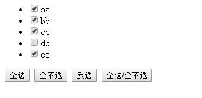

# jQuery

# 1. 简介

- 于2006年由jhon Resig 美国人创建
- 它是流程的JavaScript类库之一
- 它的梦想，write less do more (写的更少，做的更多)

# 2. 下载

官网: http://www.jquery.com

下载三个文件

- jquery-3.3.1.js
- jquery-3.3.1.min.js
- jquery-3.3.1.min.map

# 3. 初识jQuery

```html
<!DOCTYPE html>
<html lang="en">
<head>
    <meta charset="UTF-8">
    <title>jQuery初识</title>

</head>
<body>

<table width="50%" align="center" border="1" cellspacing="0" cellpadding="0" >
    <thead>
    <tr>
        <th>第一列</th>
        <th>第二列</th>
        <th>第三列</th>
    </tr>
    </thead>
    <tbody>
    <tr>
        <td>001</td>
        <td>002</td>
        <td>003</td>
    </tr>
    <tr>
        <td>001</td>
        <td>002</td>
        <td>003</td>
    </tr>
    <tr>
        <td>001</td>
        <td>002</td>
        <td>003</td>
    </tr>
    <tr >
        <td>001</td>
        <td>002</td>
        <td>003</td>
    </tr>
    </tbody>
</table>

<script src="js/jquery-3.3.1.js"></script>
<script language="JavaScript" type="text/javascript">
   /* var trs = document.getElementsByTagName("tr");
    for(var i=0;i<trs.length;i++){
        if(i%2==0){
            trs[i].style.backgroundColor="skyblue";
        }else{
            trs[i].style.backgroundColor="lightgreen";
        }
    }*/
   $("tr:odd").css("background-color","skyblue");
   $("tr:even").css("background-color","lightgreen");

</script>
</body>
</html>
```

# 4. jQuery的程序入口

- jQuery的程序入口有两种方式

```javascript
$(document).ready(function(){

});
//简写
$(function(){
   
})
```

- javascript的程序入口只有一种方式

  ```javascript
    window.onload=function(){
    
    }
  ```

- jQuery入口与JavaScript入口的三点区别、

  - jQuery入口可以有多个，但JavaScript的入口只能有一个
  - jQuery入口可以有简写的方式，但JavaScript写法只有一个
  - jQuery入加时机与JavaScript入口的加载时机不一样
    - jQuery 时机：文档标签结构加载好,速度要快些
    - JavaScript时机：窗体加载完成，如果有大图片，大视频也等待其加载完成

# 5. DOM对象与jQuery对象

- 这两都不是相等的对象，不能混用，但可以互相转换，为了避免区别，jQuery一般最前面加上$

- DOM对象转成jQuery对象

  - 使用$()

  - ```javascript
    //dom对象
    var trNode = document.getElementsByTagName("tr");
    //jquery对象
    var $tr = $( trNode);
    ```

  - 

- jQuery对象转成DOM对象

  - 使用[]

  - 使用.get()

    ```javascript
    //juqery对象
    var $tr = $("tr");
    var tr = $tr[0];
    //或
    var tr = $tr.get(0);
    ```

# 6. jQuery选择器

## 6.1. 基本选择器

```html
<!DOCTYPE html>
<html lang="en">
<head>
    <meta charset="UTF-8">
    <title>jQuery基本选择器</title>

    <script src="js/jquery-3.3.1.js"></script>
    <script type="text/javascript" language="JavaScript">
        $(function () {
            // jquery对象的方法
            // alert($("#uname").val());

            // dom对象的方法
            // alert($("#uname")[0].value);
            //alert($("#uname").get(0).value);

            //alert($(".item")[1].innerHTML);

            //alert($("div").text());
        });

 7   </script>
</head>
<body>

<input type="text" id="uname" value="张三丰">
<ul>
    <li class="item">001</li>
    <li class="item">002</li>
    <li class="item">003</li>
</ul>
<div>我是div</div>
</body>
</html>
```


## 6.2. 复合选择器

- 后代 : 空格 
- 直接子代 ： >
- 下一兄弟 : +    或 next()
- 下所有兄弟 : ~  或 nextAll()
- 上一兄弟   :  prev()
- 上所有兄弟 : prevAll()
- 交集 :  什么都没有
- 并集 : 逗号
- 通配 : *

```html
<!DOCTYPE html>
<html lang="en">
<head>
    <meta charset="UTF-8">
    <title>复合选择器</title>

    <script src="js/jquery-3.3.1.js"></script>
    <script type="text/javascript" language="JavaScript">

        $(function () {
           //后代
           //$("#article li").css("color","red");

            //直接子代
            //$("#article>li").css("color","red");

            //下一兄弟
            //$("#item+li").css("color","red");
            //$("#item").next() .css("color","red");

            //下所有兄弟
            //$("#item~li").css("color","red");
            //$("#item").nextAll("li") .css("color","red");

            //上一兄弟
            //$("#item").prev() .css("color","red");

            //上所有兄弟
            //$("#item").prevAll("li") .css("color","red");

            //交集
            // $("li#subItem").css("color","red");

            //并集
            // $("#item,#subItem").css("color","red");

            //通配
            $("*").css("color","red");
        });

    </script>
</head>
<body>

<ul id="article">
    <li>1</li>
    <li id="item">2</li>
    <li>3</li>
    <li>4</li>
    <li>5</li>
    <ul>
        <li>1</li>
        <li id="subItem">2</li>
        <li>3</li>
    </ul>
</ul>
</body>
</html>
```

## 6.3. 属性选择器

[属性名]

[属性名=值]

[属性名!=值]

[属性名*=值]

[属性名^=值]

[属性名$=值]

`[属性名][属性名=值]`

```html
<!DOCTYPE html>
<html lang="en">
<head>
    <meta charset="UTF-8">
    <title>属性选择器</title>

    <script src="js/jquery-3.3.1.js"></script>
    <script type="text/javascript" language="JavaScript">
        $(function () {
            //包含属性名
           // $("li[class]").css("background-color","skyblue");
            //属性名=值
            //$("li[class=i5]").css("background-color","skyblue");
            //属性名!=值
            //$("li[class!=i5]").css("background-color","skyblue");
            //属性名以i开头
            //$("[class^=i]").css("background-color","skyblue");
            //属性名以1结尾
            //$("[class$=1]").css("background-color","skyblue");
            //属性名只要包含1
            //$("[class*=1]").css("background-color","skyblue");
            //多个属性
            $("li[class][title$=1]").css("background-color","skyblue");
        });

    </script>
</head>
<body>

<ul>
    <li class="i1">001</li>
    <li class="i2">002</li>
    <li class="i3">003</li>
    <li class="i4">004</li>
    <li class="i5" title="t1">005</li>
    <li class="i6" title="t2">006</li>
    <li class="i7">007</li>
    <li class="i8">008</li>
</ul>
<span class="s1">ssssssssssssssssssss</span>
</body>
</html>
```

## 6.4. 过滤选择器

### 6.4.1. 基本过滤选择器

:odd

:even

:first

:last

:not()

:eq()

:gt()

:lt()

:header

:aimated

```html
<!DOCTYPE html>
<html lang="en">
<head>
    <meta charset="UTF-8">
    <title>基本过滤选择器</title>
    <style type="text/css">
        #dong{
            width: 300px;
            height: 300px;
            border: 1px solid red;
            position: absolute;
        }
    </style>
    <script src="js/jquery-3.3.1.js"></script>
    <script type="text/javascript" language="JavaScript">
        $(function () {
            //奇数行
            //$("li:even").css("background-color","lightgreen");
            //偶数行
            //$("li:odd").css("background-color","gray");
            //第一行
            //$("li:first").css("background-color","lightgreen");
            //最后一行
            //$("li:last").css("background-color","lightgreen");
            //第三行
           // $("li:eq(2)").css("background-color","lightgreen");
            //超过第三行的
            //$("li:gt(2)").css("background-color","lightgreen");
            //小于第三行的
            //$("li:lt(2)").css("background-color","lightgreen");
            //不是第三行
           // $("li:not(li:eq(2))").css("background-color","lightgreen");
            //标题标签
            //$("h1:header").css("background-color","lightgreen");


            $("input:last").click(function () {
               $("#dong").animate({
                   left:"+=1000"
               },5000).animate({
                   top:"+=1000"
               },5000);

                //获取动画
                $("div:animated").css("background-color","lightgreen");
            });


        });
    </script>
</head>
<body>
    <div>
        <h2>h2222222</h2>
        <h1>h1111111</h1>
        <ul>
            <li>l1</li>
            <li>l2</li>
            <li>l3</li>
            <li>l4</li>
            <li>l5</li>
            <li>l6</li>
            <li>l7</li>
            <li>l8</li>
        </ul>
    </div>
    <input type="text">
    <input type="button" value="启动">
    <div id="dong">
        好好学习
    </div>
</body>
</html>
```

### 6.4.2. 可见性过滤选择器

- :hidden 查隐藏的
- :visible 查显示的

```html
<!DOCTYPE html>
<html lang="en">
<head>
    <meta charset="UTF-8">
    <title>可见性过渡选择器</title>

    <style type="text/css">
        div{
            border: 1px solid red;
        }
    </style>
    <script src="js/jquery-3.3.1.js">
    </script>
    <script type="text/javascript" language="JavaScript">
        $(function () {

            $("p:eq(0)").click(function () {
                $("div:hidden").show(2000);
            });

            $("p:eq(1)").click(function () {
                $("div:visible").hide(2000);
            });

            $("p:eq(2)").click(function () {
                $("div").toggle(2000);
            });
        });

    </script>
</head>
<body>
<p id="p_show">点我显示</p>
<p id="p_hide">点我隐藏</p>
<p id="p_toggle">点我切换</p>

<div>
    我是div的内容
</div>
</body>
</html>
```

### 6.4.3. 内容过滤选择器

:contains()  包含内容

:empty()  不包含内容

:has()   包含选择器

:parent() 包含子元素或内容

```html
<!DOCTYPE html>
<html lang="en">
<head>
    <meta charset="UTF-8">
    <title>内容过滤选择器</title>

    <script src="js/jquery-3.3.1.js"></script>
    <script type="text/javascript" language="JavaScript">
        $(function () {
            //内容包含
            //$("div:contains('div')").css("background-color","chocolate");
            //内容为空
            //$("div:empty").css("background-color","chocolate");
            //内容不为空
            //$("div:not(div:empty)").css("background-color","chocolate");
            //选择器包含
            //$("div:has('.mini')").css("background-color","chocolate");
            //父容器
            $("div:parent").css("background-color","skyblue");
        });
    </script>
</head>
<body>
<div>div1</div>
<div>
    <div>div2</div>
</div>
<div style="height: 10px"></div>
<div>
    <span class="mini">mini</span>
</div>
</body>
</html>
```

### 6.4.4. 子元素过滤选择器

: nth-child

:first-child

:last-child

:only-child

```html
<!DOCTYPE html>
<html lang="en">
<head>
    <meta charset="UTF-8">
    <title>子元素过滤选择器</title>

    <script src="js/jquery-3.3.1.js"></script>
    <script type="text/javascript" language="JavaScript">
        $(function () {
           //第一个
            // $("li:first-child").css("background-color","lightgreen");
           //最后一个
            // $("li:last-child").css("background-color","lightgreen");
            //第三个
            //$("li:nth-child(3)").css("background-color","lightgreen");
            //只有一个
            $("li:only-child").css("background-color","lightgreen");
        });
    </script>
</head>
<body>
<div>
    <ul>
        <!--<span>aaa</span>-->
        <li>001</li>
        <li>002</li>
        <li>003</li>
        <li>004</li>
        <li>005</li>
    </ul>
    <ul>
        <li>other</li>
    </ul>
</div>
</body>
</html>
```

### 6.4.5. 表单过滤选择器

:input

:text

:password

:radio

:checkbox

:submit

:reset

:image

:button

:file

:hidden

:checked

:selected

:disabled

:enabled

```html
<!DOCTYPE html>
<html lang="en">
<head>
    <meta charset="UTF-8">
    <title>表单选择器</title>

    <script src="js/jquery-3.3.1.js"></script>
    <script type="text/javascript" language="JavaScript">
        $(function () {


            $(":submit").click(function () {

                console.log($(":text:first").val());
                console.log($(":password").val());
                console.log($(":radio:checked").val());
                //console.log($(":checkbox:checked").length);
                $(":checkbox:checked").each(function (item,chk) {
                    console.log(chk.value);
                });

                console.log($("#birthday :selected").val());
                console.log($("#lovecity :selected").val());
                console.log($(":file").val());
                console.log($("#info").val());
                console.log($("input:hidden").val());

                return false;
            });
        });
    </script>
</head>
<body>
<form action="01_html入门.html" method="get">

    <!--table[width="60%"][align="center"]>tr*9>td*2-->
    <table width="60%" align="center" border="0">
        <caption>用户注册</caption>
        <tr>
            <td> <!--标签-->
                <label for="txtName">用户名:</label></td>
            <td> <!--input标签 ：文本框-->
                <input type="hidden" name="id" value="1001">
                <input type="text" id="txtName" name="txtName" value="张三"/></td>
        </tr>
        <tr>
            <td>
                <label for="pwd">密&nbsp;&nbsp;&nbsp;码:</label>
            </td>
            <td>
                <input type="password" id="pwd" name="pwd">
            </td>
        </tr>
        <tr>
            <td>
                <label for="gender">性别:</label>
            </td>
            <td>
                <input type="radio" id="gender" name="gender" value="male">男
                <input type="radio" name="gender" checked value="female">女
            </td>
        </tr>
        <tr>
            <td>
                <label for="hobby">爱好</label>
            </td>
            <td>
                <input type="checkbox" id="hobby" name="hobby" value="travel">旅游
                <input type="checkbox" name="hobby" value="music">音乐
                <input type="checkbox" name="hobby" checked value="reading">读书
                <input type="checkbox" name="hobby" value="swim">游泳
            </td>
        </tr>
        <tr>
            <td>
                <label for="birthday">出生年</label>
            </td>
            <td>
                <select name="birthday" id="birthday">
                    <option value="1990">1990</option>
                    <option value="1991">1991</option>
                    <option value="1993">1993</option>
                    <option value="1994">1994</option>
                    <option value="1995" selected>1995</option>
                </select>
            </td>
        </tr>
        <tr>
            <td>
                <label for="lovecity">向往的城市</label>
            </td>
            <td>
                <select name="lovecity" id="lovecity" multiple>
                    <option value="nanjing">南京</option>
                    <option value="suzhou">苏州</option>
                    <option value="wuxi">无锡</option>
                    <option value="changzhou">常州</option>
                </select>
            </td>
        </tr>
        <tr>
            <td>
                <label for="photo"> 头像</label>
            </td>
            <td>
                <input type="file" id="photo" name="photo">
            </td>
        </tr>
        <tr>
            <td>
                <label for="info">自我介绍</label>
            </td>
            <td>
                <textarea name="info" id="info" cols="50" rows="10"></textarea>
            </td>
        </tr>
        <tr>
            <td>
                <input type="submit" value="提交">
            </td>
            <td>
                <input type="button" value="普通按钮">
                <input type="reset" value="重置">
            </td>
        </tr>
    </table>
</form>
</body>
</html>
```

# 7. 事件

## 7.1. 基础事件

- 鼠标事件
  - mouseover()
  - mouseout()
  - mousedown()
  - mouseup()
  - mouseenter()
- 键盘
  - keydown()
  - keyup()
  - keypress()
- 表单
  - focus()
  - blur()
  - submit()
  - change()
  - click()
- 事件有一个内置对象 event
  - evnet.target
- 绑定事件的四种方式
  - 元素节点.事件名();
  - bind("事件名",function(){})
  - on("事件名",function(){})
  - one("事件名",function(){})
- 称除事件的两种方式
  - unbind() : 移除所有事件
  - unbind("事件名") 移除某个事件
  - off("事件名")  移除某个事件
- 模拟触发事件
  - trigger(""事件名"")

```html
<!DOCTYPE html>
<html lang="en">
<head>
    <meta charset="UTF-8">
    <title>事件</title>
    <script src="js/jquery-3.3.1.js"></script>
    <script type="text/javascript" language="JavaScript">
        $(function(){
            //绑定方式一:
            $("select").change(function (event,a,b) {
                console.log($(this).val(),event.target.value,a,b);
            });

            //绑定方式二:
           /* $("select").bind("change",function () {
                console.log($(this).val());
            });*/

            //绑定方式三:
           /* $("select").on("change",function () {
                console.log($(this).val());
            });*/

            //绑定方式四: 只触发一次事件
          /*  $("select").one("change",function () {
                console.log($(this).val());
            });*/


          //取消一
            $("button:eq(1)").click(function () {
                $("select").unbind("change");
                return false;
            });

            //取消二
            $("button:eq(2)").click(function () {
                $("select").off("change");
                return false;
            });

            //模拟触发
            $("button:eq(0)").click(function () {
                $("select").trigger('change',[11,22]);
                return false;
            });

        });
    </script>
</head>
<body>
<form action="">
    <select name="" id="">
        <option value="1">1</option>
        <option value="2">2</option>
        <option value="3">3</option>
    </select>
    <button>trigger</button>
    <button>cancel click1</button>
    <button>cancel click2</button>
</form>
</body>
</html>
```

## 7.2. 复合事件

- hover() 相当于mouseover()和mouseout()
- toggle()相当鼠标的连续点击事件(1.9之后过期)，和元素的显示或隐藏

```html
<!DOCTYPE html>
<html lang="en">
<head>
    <meta charset="UTF-8">
    <title>复合事件</title>
    <style>

        li{
            border: 1px solid red;
            width: 100px;
            list-style: none;
        }
    </style>
    <script src="js/jquery-3.3.1.js"></script>
    <script type="text/javascript" language="JavaScript">
        $(function(){
           /* $("li").mouseover(function () {
                $(this).css("background-color","#F40")
            }).mouseout(function () {
                $(this).css("background-color","#fff")
            });*/

            $("li").hover(function () {
                $(this).css("background-color","#F40")
            },function () {
                $(this).css("background-color","#fff")
            })

            //toggle()显示与隐藏
            $("button").click(function () {
                $("ul").toggle('slow');
            });
        });
    </script>
</head>
<body>
<button>隐藏</button>
<hr>
<ul>
    <li>1</li>
    <li>2</li>
    <li>3</li>
    <li>4</li>
    <li>5</li>
    <li>6</li>
    <li>7</li>
    <li>8</li>
</ul>
</body>
</html>
```

## 7.3. 事件冒泡

- 当元素重叠，且事件相同时就能出现冒泡

- 阻止冒泡  event.propagation()

```html
<!DOCTYPE html>
<html lang="en">
<head>
    <meta charset="UTF-8">
    <title>事件冒泡</title>
    <style type="text/css">
        #first {
            width: 500px;
            height: 500px;
            border: 1px solid red;
            margin: 0 auto;
        }

        #second {
            width: 300px;
            height: 300px;
            margin: 100px;
            border: 1px solid green;
        }

        #third {
            width: 100px;
            height: 100px;
            border: 1px solid blue;
            margin: 100px;
        }


    </style>
    <script src="js/jquery-3.3.1.js"></script>
    <script type="text/javascript" language="JavaScript">
        $(function () {
            $("#first").mouseover(function (event) {
                alert(1);
                event.stopPropagation();
            });

            $("#second").mouseover(function (event) {
                alert(2);
                event.stopPropagation();
            });

            $("#third").mouseover(function (event) {
                alert(3);
                event.stopPropagation();
            });
        });
    </script>
</head>
<body>
<div id="first">我是最里边的first
    <div id="second">我是最里边的second
        <div id="third">我是最里边的div</div>
    </div>
</div>
</body>
</html>
```

# 8. 动画

## 8.1.  显示和隐藏

- show()
- hide()
- toggle()

## 8.2. 淡入和淡出

- fadeIn()
- fadeOut()

## 8.3. 滑动

- slideDown()
- slideUp()
- slideToggle()

## 8.4. 自定义动画

- animate({参数},毫秒)

```html
<!DOCTYPE html>
<html lang="en">
<head>
    <meta charset="UTF-8">
    <title>动画</title>
    <style>
        div{
            border: 1px solid red;
            width: 300px;
            height: 200px;
            position: relative;
        }
    </style>
    <script src="js/jquery-3.3.1.js"></script>
    <script type="text/javascript" language="JavaScript">
        $(function(){
           $("button:eq(0)").click(function () {
               $("div:first").show(2000); //fast slow 毫秒
           });
           $("button:eq(1)").click(function () {
               $("div:first").hide(2000);
           });
           $("button:eq(2)").click(function () {
               $("div:first").toggle(2000);
           });

            $("button:eq(3)").click(function () {
                $("div:first").fadeIn(2000); //fast slow 毫秒
            });
            $("button:eq(4)").click(function () {
                $("div:first").fadeOut(2000);
            });
            $("button:eq(5)").click(function () {
                $("div:first").fadeToggle(2000);
            });

            $("button:eq(6)").click(function () {
                $("div:first").slideDown(2000); //fast slow 毫秒
            });
            $("button:eq(7)").click(function () {
                $("div:first").slideUp(2000);
            });
            $("button:eq(8)").click(function () {
                $("div:first").slideToggle(2000);
            });
            $("button:eq(9)").click(function () {
                $("div:first").animate({left:"+=1000px"},5000).animate({top:"+=500px"},5000);
            });
        });
    </script>
</head>
<body>
    <div>
        我是一个div
    </div>
    <hr>
    <button>显示</button>
    <button>隐藏</button>
    <button>切换</button>
    <hr>
    <button>淡入</button>
    <button>淡出</button>
    <button>切换</button>
    <hr>
    <button>滑下</button>
    <button>滑上</button>
    <button>切换</button>
    <hr>
<button>我的动画</button>
</body>
</html>
```

# 9. jQuery中的DOM操作

## 9.1. 属性操作

- 常用方法
  - attr("属性名","属性值")
  - remove("属性名");
  - prop("属性名","属性值")
  - removeProp("属性名")  测试无效 

 ```html
<!DOCTYPE html>
<html lang="en">
<head>
    <meta charset="UTF-8">
    <title>属性</title>
    <script src="js/jquery-3.3.1.js"></script>
    <script type="text/javascript" language="JavaScript">
        $(function(){

            $("button:eq(0)").click(function () {
                $("img").attr("src","img/1.gif");
            });
            $("button:eq(1)").click(function () {
                $("img").removeAttr("src");
            });
            $("button:eq(2)").click(function () {
                $("img").prop("src","img/1.gif");
            });
            $("button:eq(3)").click(function () {
                $("img").removeProp("src");
            });
        });
    </script>
</head>
<body>

<hr>
<button>添加图片</button>
<button>移除图片</button>
<hr>
<button>添加图片</button>
<button>移除图片</button>
</body>
</html>
 ```

## 9.2.  样式操作

- css("样式名","样式值");
- addClass() 加class样式 
- removeClass() 移除class样式 
- toggleClass() 切换class样式
- hasClass() 是否包含样式 

```html
<!DOCTYPE html>
<html lang="en">
<head>
    <meta charset="UTF-8">
    <title>样式操作</title>
    <style type="text/css">
        .myclass{
            border: 1px solid green;;
        }

    </style>
    <script src="js/jquery-3.3.1.js"></script>
    <script type="text/javascript" language="JavaScript">
        $(function(){

            $("img").hover(function () {
                //行内样式
               // $(this).css("border","1px solid red")
                //class样式
                $(this).addClass("myclass");
            },function () {
                //$(this).css("border","");
                $(this).removeClass("myclass");
            });

            $("button:first").click(function(){
                $("img").toggleClass("myclass");
            });

            $("button:last").click(function(){
               alert( $("img").hasClass("myclass"));
            });
        });
    </script>
</head>
<body>

<button>切换</button>
<button>包含</button>
</body>
</html>
```

## 9.3. 内容获取

- val()       理解成DOM中的value
- html()    理解成DOM中的innerHTML
- text()      理解成DOM中的innerText 

```html
<!DOCTYPE html>
<html lang="en">
<head>
    <meta charset="UTF-8">
    <title>查询内容</title>
    <script src="js/jquery-3.3.1.js"></script>
    <script type="text/javascript" language="JavaScript">
        $(function(){

            $("button:eq(0)").click(function () {
                alert($("input").val());

                //DOM
                // $("input")[0].value;
            });
            $("button:eq(1)").click(function () {
                alert($("div").text());
            });
            $("button:eq(2)").click(function () {
                alert($("div").html());
            });

        });
    </script>
</head>
<body>

<input type="text">
<div>
    <b>我是一断加粗的内容</b>
</div>
<hr>
<button>value</button>
<button>text</button>
<button>html</button>
</body>
</html>
```

## 9.4.  节点操作

### 9.4.1. 插入节点

- 内部操作
  - 标签.append(内容)
  - 内容.appendTo(标签)
  - prepend(内容)
  - 内容.prependTo(标签)
- 外部操作
  - 标签.after(内容)
  - 标签.before(内容)
  - 内容.insertAfter(标签)
  - 内容.nsertBefore(标签)
- 以上方法不但能进插入操作，还可以进

```html
<!DOCTYPE html>
<html lang="en">
<head>
    <meta charset="UTF-8">
    <title>节点插入操作</title>
    <script src="js/jquery-3.3.1.js"></script>
    <script type="text/javascript" language="JavaScript">
        $(function(){
            //插入,内部
            //后
           $("button:eq(0)").click(function () {
               $("ul").append("<li>叮铛猫</li>");
           });
            $("button:eq(1)").click(function () {
                $("<li>叮铛猫</li>").appendTo("ul");
            });

            //插入,内部
            //前
            $("button:eq(2)").click(function () {
                $("ul").prepend("<li>波斯猫</li>");
            });
            $("button:eq(3)").click(function () {
                $("<li>波斯猫</li>").prependTo("ul");
            });

            //插入,外部
            //前
            $("button:eq(4)").click(function () {
               // $("ul").before("<div>前</div>")
                $("<div>前</div>").insertBefore("ul");
            });
            //后
            $("button:eq(5)").click(function () {
                //$("ul").after("<span>后</span>");
                $("<span>后</span>").insertAfter("ul");
            });

            //移动
            $("button:eq(6)").click(function () {
                $("ul").append($("li:eq(0)"));
            });
        });
    </script>
</head>
<body>
    <h2>你最爱歌曲</h2>
    <ul>
        <li>小苹果</li>
        <li>民族风</li>
        <li>伤不起</li>
    </ul>
    <hr>
    <button>after</button>
    <button>after</button>
    <button>before</button>
    <button>before</button>
    <hr>
    <button>outer before</button>
    <button>outer after</button>
    <hr>
    <button>move</button>
</body>
</html>
```

### 9.4.2. 删除节点 

- remove(): 删除本身和子元素，事件也删除，返回的是删除的jQuery对象
- detach(): 删除本身和子元素，事件不删除，返回的是删除的jQuery对象
- empty(); 清空节点-清除元素的内容

```html
<!DOCTYPE html>
<html lang="en">
<head>
    <meta charset="UTF-8">
    <title>节点插入操作</title>
    <script src="js/jquery-3.3.1.js"></script>
    <script type="text/javascript" language="JavaScript">
        $(function(){

            $("li").click(function () {
               alert($(this).text());
            });

            //插入,内部
            //后
           $("button:eq(0)").click(function () {
               $("ul").append("<li>叮铛猫</li>");
           });
            $("button:eq(1)").click(function () {
                $("<li>叮铛猫</li>").appendTo("ul");
            });

            //插入,内部
            //前
            $("button:eq(2)").click(function () {
                $("ul").prepend("<li>波斯猫</li>");
            });
            $("button:eq(3)").click(function () {
                $("<li>波斯猫</li>").prependTo("ul");
            });

            //插入,外部
            //前
            $("button:eq(4)").click(function () {
               // $("ul").before("<div>前</div>")
                $("<div>前</div>").insertBefore("ul");
            });
            //后
            $("button:eq(5)").click(function () {
                //$("ul").after("<span>后</span>");
                $("<span>后</span>").insertAfter("ul");
            });

            //移动
            $("button:eq(6)").click(function () {
                $("ul").append($("li:eq(0)"));
            });
            //删除
            $("button:eq(7)").click(function () {
                var $delObj = $("li:last").remove();
                $("ul").prepend($delObj);
            });
            $("button:eq(8)").click(function () {
                var $delObj = $("li:last").detach();
                $("ul").prepend($delObj);
            });
            $("button:eq(9)").click(function () {
                $("li:last").empty();
            });
        });
    </script>
</head>
<body>
    <h2>你最爱歌曲</h2>
    <ul>
        <li>小苹果</li>
        <li>民族风</li>
        <li>伤不起</li>
    </ul>
    <hr>
    <button>after</button>
    <button>after</button>
    <button>before</button>
    <button>before</button>
    <hr>
    <button>outer before</button>
    <button>outer after</button>
    <hr>
    <button>move</button>
    <hr>
    <button>remove</button>
    <button>detach</button>
    <button>empty</button>
</body>
</html>
```

### 9.4.3. 修改节点

- 复制
  - clone() 克隆文本
  - clone(true) 克隆文本和事件
- 替换
  - 标签.replaceWith(内容)
  - 内容.replaceAll(标签)

- 包裹
  - wrap()
  - wrapAll()
  - wrapInner()

```html
<!DOCTYPE html>
<html lang="en">
<head>
    <meta charset="UTF-8">
    <title>节点插入操作</title>
    <script src="js/jquery-3.3.1.js"></script>
    <script type="text/javascript" language="JavaScript">
        $(function () {

            $("li").click(function () {
                alert($(this).text());
            });

            //插入,内部
            //后
            $("button:eq(0)").click(function () {
                $("ul").append("<li>叮铛猫</li>");
            });
            $("button:eq(1)").click(function () {
                $("<li>叮铛猫</li>").appendTo("ul");
            });

            //插入,内部
            //前
            $("button:eq(2)").click(function () {
                $("ul").prepend("<li>波斯猫</li>");
            });
            $("button:eq(3)").click(function () {
                $("<li>波斯猫</li>").prependTo("ul");
            });

            //插入,外部
            //前
            $("button:eq(4)").click(function () {
                // $("ul").before("<div>前</div>")
                $("<div>前</div>").insertBefore("ul");
            });
            //后
            $("button:eq(5)").click(function () {
                //$("ul").after("<span>后</span>");
                $("<span>后</span>").insertAfter("ul");
            });

            //移动
            $("button:eq(6)").click(function () {
                $("ul").append($("li:eq(0)"));
            });
            //删除
            $("button:eq(7)").click(function () {
                var $delObj = $("li:last").remove();
                $("ul").prepend($delObj);
            });
            $("button:eq(8)").click(function () {
                var $delObj = $("li:last").detach();
                $("ul").prepend($delObj);
            });
            $("button:eq(9)").click(function () {
                $("li:last").empty();
            });
            //复制
            $("button:eq(10)").click(function () {
                $("ul").append($("li:last").clone());
            });
            $("button:eq(11)").click(function () {
                $("ul").append($("li:last").clone(true));
            });
            //替换
            $("button:eq(12)").click(function () {
                $("li:last").replaceWith("<li>万和动作片</li>");
            });
            $("button:eq(13)").click(function () {
                $("<li>万和动作片</li>").replaceAll("li:last");
            });
            //包裹
            $("button:eq(14)").click(function () {
                $("li").wrap("<span></span>");
            });
            $("button:eq(15)").click(function () {
                $("li").wrapAll("<span></span>");
            });
            $("button:eq(16)").click(function () {
                $("li").wrapInner("<span></span>");
            });
        });
    </script>
</head>
<body>
<h2>你最爱歌曲</h2>
<ul>
    <li>小苹果</li>
    <li>民族风</li>
    <li>伤不起</li>
</ul>
<hr>
<button>after</button>
<button>after</button>
<button>before</button>
<button>before</button>
<hr>
<button>outer before</button>
<button>outer after</button>
<hr>
<button>move</button>
<hr>
<button>remove</button>
<button>detach</button>
<button>empty</button>
<hr>
<button>copy</button>
<button>copy(true)</button>
<hr>
<button>replaceWith</button>
<button>replaceAll</button>
<hr>
<button>wrap</button>
<button>wrapall</button>
<button>wrapinner</button>
</body>
</html>
```

# 10. 相关函数data()、each()、serialize()

```html
<!DOCTYPE html>
<html lang="en">
<head>
    <meta charset="UTF-8">
    <title>三个函数</title>
    <script src="js/jquery-3.3.1.js"></script>
    <script type="text/javascript" language="JavaScript">
        $(function(){

            $("button:first").click(function () {
                //alert($("div").attr("data-id"));
                alert($("div").data("name"));
            });

            $("button:eq(1)").click(function () {
                var arr=[];
                $("[name='hobby']:checked").each(function (index,item) {
                    arr.push(item.value);
                })
                alert(arr.join(","));
            });

            $("button:eq(2)").click(function () {
                var arr=[];
                $.each( $("[name='hobby']:checked"),function (index,item) {
                    arr.push(item.value);
                });
                alert(arr.join(","));
            });
            
            $("input:last").click(function () {
                window.location.href="01_jQuery初识.html?"+$("form").serialize();
            });
        });
    </script>
</head>
<body>
        <div data-id="1001" data-name="张三" >这是div的内容</div>
        <input type="checkbox" name="hobby" value="travel">旅游
        <input type="checkbox" name="hobby" value="swim">游泳
        <input type="checkbox" name="hobby" value="reading">读书
        <input type="checkbox" name="hobby" value="music">音乐
        <hr>
        <button>data值</button>
        <button>hobbys</button>
        <button>hobbys</button>
        <hr>
        <form action="">
           用户名 <input type="text" name="uname">
           最小年龄~最大年龄 : <input type="text" name="minAge">~ <input type="text" name="maxAge">
            <input type="button" value="search">
        </form>

</body>
</html>
```

# 11. jQuery Validate 验证插件

## 11.1. 使用

- 加入jQuery的js
- 加入jQuery_validate.js

```html
 <!--jquery-->
    <script src="js/jquery-3.3.1.js"></script>
    <!--jquery validate-->
    <script src="js/validate/jquery.validate.js"></script>
```

## 11.2 验证种类

```html
required:true
remote:"xxx"
emial:true
url:true
date:true
dateISO:true
number:true (负数，小数)
digits:true （整数）
creditcard:true
equalTo:"#密码"
maxlength:5
minlength:10
rangelegnth:[5,10]
min:5
max:10
range:[5,10]
```

## 11.3. 使用验证放在js中，代码如下

```html
<!DOCTYPE html>
<html lang="en">
<head>
    <meta charset="UTF-8">
    <title>validate</title>
    <style>
        .error{
            color: red;
        }
    </style>
    <!--jquery-->
    <script src="js/jquery-3.3.1.js"></script>
    <!--jquery validate-->
    <script src="js/validate/jquery.validate.js"></script>
    <script src="js/validate/localization/messages_zh.js"></script>
    <script type="text/javascript" language="JavaScript">
        $(function(){
            $("form").validate({
                //规则
                rules:{
                    txtName:{
                        required:true,
                        rangelength:[4,10]
                    }
                },
                //提示消息，如果不加有默认消息，默认消息在messages_zh.js中
                messages:{
                    txtName:{
                        required:"用户名不能为空"
                    }
                },
                //设置统一提交处理，如果不加此行，则采用form默认提交 
                submitHandler:function(form){
                    alert(1);
                    form.submit();
                }
            });
        });
    </script>
</head>
<body>
<form action="#" method="get">

    <!--table[width="60%"][align="center"]>tr*9>td*2-->
    <table width="60%" align="center" border="0">
        <caption>用户注册</caption>
        <tr>
            <td> <!--标签-->
                <label for="txtName">用户名:</label></td>
            <td> <!--input标签 ：文本框-->
                <input type="hidden" name="id" value="1001">
                <input type="text" id="txtName" name="txtName" /></td>
        </tr>
        <tr>
            <td>
                <label for="pwd">密&nbsp;&nbsp;&nbsp;码:</label>
            </td>
            <td>
                <input type="password" id="pwd" name="pwd">
            </td>
        </tr>
        <tr>
            <td>
                <label for="gender">性别:</label>
            </td>
            <td>
                <input type="radio" id="gender" name="gender" value="male">男
                <input type="radio" name="gender" checked value="female">女
            </td>
        </tr>
        <tr>
            <td>
                <label for="hobby">爱好</label>
            </td>
            <td>
                <input type="checkbox" id="hobby" name="hobby" value="travel">旅游
                <input type="checkbox" name="hobby" value="music">音乐
                <input type="checkbox" name="hobby" checked value="reading">读书
                <input type="checkbox" name="hobby" value="swim">游泳
            </td>
        </tr>
        <tr>
            <td>
                <label for="birthday">出生年</label>
            </td>
            <td>
                <select name="birthday" id="birthday">
                    <option value="1990">1990</option>
                    <option value="1991">1991</option>
                    <option value="1993">1993</option>
                    <option value="1994">1994</option>
                    <option value="1995" selected>1995</option>
                </select>
            </td>
        </tr>
        <tr>
            <td>
                <label for="lovecity">向往的城市</label>
            </td>
            <td>
                <select name="lovecity" id="lovecity" multiple>
                    <option value="nanjing">南京</option>
                    <option value="suzhou">苏州</option>
                    <option value="wuxi">无锡</option>
                    <option value="changzhou">常州</option>
                </select>
            </td>
        </tr>
        <tr>
            <td>
                <label for="photo"> 头像</label>
            </td>
            <td>
                <input type="file" id="photo" name="photo">
            </td>
        </tr>
        <tr>
            <td>
                <label for="info">自我介绍</label>
            </td>
            <td>
                <textarea name="info" id="info" cols="50" rows="10"></textarea>
            </td>
        </tr>
        <tr>
            <td>
                <input type="submit" value="提交">
            </td>
            <td>
                <input type="button" value="普通按钮">
                <input type="reset" value="重置">
            </td>
        </tr>
    </table>


</form>
</body>
</html>
```

## 11.4. 优化消息位置

 errorPlacement:function(error,element){}

```javascript
errorPlacement:function (error,element) {
    if(element.prop("type")=="radio" ||element.prop("type")=="checkbox"){
        element.parent().append(error);
    }else {
        element.after(error);
    }
}
```

## 11.5. 验证的触发方式, 一般用默认的即可，不更改

- onsubmit
- onblur
- onkeyup
- onclick

## 11.6. 错误元素和错误样式，一般更改

- errorElement:"label"
- errorClass:"error"

## 11.7. 扩展验证

```javascript

jQuery.validator.addMethod("xx名",function (value,element) {
    var pattern = /^xxx$/
    return pattern.test(value);
})
```


```html
<!DOCTYPE html>
<html lang="en">
<head>
    <meta charset="UTF-8">
    <title>validate</title>
    <style>
        .error{
            color: red;
        }
    </style>
    <!--jquery-->
    <script src="js/jquery-3.3.1.js"></script>
    <!--jquery validate-->
    <script src="js/validate/jquery.validate.js"></script>
    <script src="js/validate/localization/messages_zh.js"></script>
    <script type="text/javascript" language="JavaScript">
        $(function(){

            jQuery.validator.addMethod("mobilephone",function (value,element) {
                var mobilephone = /^\d{11}$/
                return mobilephone.test(value);
            })

            $("form").validate({
                rules:{
                    txtName:{
                        required:true,
                        rangelength:[4,10]
                    },
                    mobilephone:{
                        mobilephone:true
                    },
                    gender:{
                        required:true
                    },
                    hobby:{
                        required:true
                    }
                },
                messages:{
                    txtName:{
                        required:"用户名不能为空",
                        rangelength:"用户名的长度只能在4到10之间"
                    },
                    mobilephone:{
                        mobilephone:"手机号不正确"
                    },
                    gender:{
                        required:"性别不能为空"
                    },
                    hobby:{
                        required:"爱好不能为空"
                    }
                },
                submitHandler:function(form){
                    alert(1);
                    //form.submit();
                },
                errorPlacement:function (error,element) {
                    if(element.prop("type")=="radio" ||element.prop("type")=="checkbox"){
                        element.parent().append(error);
                    }else {
                        element.after(error);
                    }
                },
                errorElement: "label",
                errorClass:"error"
            });
        });
    </script>
</head>
<body>
<form action="#" method="get">

    <!--table[width="60%"][align="center"]>tr*9>td*2-->
    <table width="60%" align="center" border="0">
        <caption>用户注册</caption>
        <tr>
            <td> <!--标签-->
                <label for="txtName">用户名:</label></td>
            <td> <!--input标签 ：文本框-->
                <input type="hidden" name="id" value="1001">
                <input type="text" id="txtName" name="txtName" /></td>
        </tr>
        <tr>
            <td>
                <label for="pwd">密&nbsp;&nbsp;&nbsp;码:</label>
            </td>
            <td>
                <input type="password" id="pwd" name="pwd">
            </td>
        </tr>
        <tr>
            <td>
                <label for="mobilephone">手机号:</label>
            </td>
            <td>
                <input type="text" id="mobilephone" name="mobilephone">
            </td>
        </tr>
        <tr>
            <td>
                <label for="gender">性别:</label>
            </td>
            <td>
                <input type="radio" id="gender" name="gender" value="male">男
                <input type="radio" name="gender"  value="female">女
            </td>
        </tr>
        <tr>
            <td>
                <label for="hobby">爱好</label>
            </td>
            <td>
                <input type="checkbox" id="hobby" name="hobby" value="travel">旅游
                <input type="checkbox" name="hobby" value="music">音乐
                <input type="checkbox" name="hobby"  value="reading">读书
                <input type="checkbox" name="hobby" value="swim">游泳
            </td>
        </tr>
        <tr>
            <td>
                <label for="birthday">出生年</label>
            </td>
            <td>
                <select name="birthday" id="birthday">
                    <option value="1990">1990</option>
                    <option value="1991">1991</option>
                    <option value="1993">1993</option>
                    <option value="1994">1994</option>
                    <option value="1995" selected>1995</option>
                </select>
            </td>
        </tr>
        <tr>
            <td>
                <label for="lovecity">向往的城市</label>
            </td>
            <td>
                <select name="lovecity" id="lovecity" multiple>
                    <option value="nanjing">南京</option>
                    <option value="suzhou">苏州</option>
                    <option value="wuxi">无锡</option>
                    <option value="changzhou">常州</option>
                </select>
            </td>
        </tr>
        <tr>
            <td>
                <label for="photo"> 头像</label>
            </td>
            <td>
                <input type="file" id="photo" name="photo">
            </td>
        </tr>
        <tr>
            <td>
                <label for="info">自我介绍</label>
            </td>
            <td>
                <textarea name="info" id="info" cols="50" rows="10"></textarea>
            </td>
        </tr>
        <tr>
            <td>
                <input type="submit" value="提交">
            </td>
            <td>
                <input type="button" value="普通按钮">
                <input type="reset" value="重置">
            </td>
        </tr>
    </table>


</form>
</body>
</html>
```

# 12.ajax

- $.ajax()
- $.get()
- $.post()
- $.getJson()
- $.getScript()

```html
<!DOCTYPE html>
<html lang="en">
<head>
    <meta charset="UTF-8">
    <title>ajax - 异步请求(局部刷新)-DOM操作</title>
</head>
<body>

<table width="50%" align="center" border="1px" cellpadding="0" cellspacing="0">
    <tr>
        <th>学号</th>
        <th>姓名 </th>
        <th>年龄</th>
        <th>性别</th>
        <th>地址</th>
        <th>操作</th>
    </tr>

</table>

<button>ajax</button>
<button>get</button>
<button>post</button>
<button>getson</button>
<button>load-html</button>
<button>getscript-script</button>

<script src="js/jquery-3.3.1.js"></script>
<script type="text/javascript" language="JavaScript">

   $("button:eq(0)").click(function () {
       $.ajax({
           post:"post",
           url:"data/stu.json",
           datatype:"json",
           success:function(data){
              $(data).each(function (index,stu) {
                var rowData = "<tr><td>"+stu.id+"</td><td>"+stu.name+"</td><td>"+stu.age+"</td><td>"+stu.gender+"</td><td>"+stu.address+"</td>" +
                    "<td><a href='javascript:void(0)' name='del'>删除</a>|<a href=''>修改</a></td></tr>";
                $("table").append(rowData);
              });

               $("table a[name='del']").click(function(){
                   $(this).parent().parent().remove();
               });
           }
       });
   });

   $("button:eq(1)").click(function () {
        $.get("data/stu.json","json",function(data){
            $(data).each(function (index,stu) {
                var rowData = "<tr><td>"+stu.id+"</td><td>"+stu.name+"</td><td>"+stu.age+"</td><td>"+stu.gender+"</td><td>"+stu.address+"</td>" +
                    "<td><a href='javascript:void(0)' name='del'>删除</a>|<a href=''>修改</a></td></tr>";
                $("table").append(rowData);
            });

            $("table a[name='del']").click(function(){
                $(this).parent().parent().remove();
            });
        })
   });

   $("button:eq(2)").click(function () {
       $.post("data/stu.json","json",function(data){
           $(data).each(function (index,stu) {
               var rowData = "<tr><td>"+stu.id+"</td><td>"+stu.name+"</td><td>"+stu.age+"</td><td>"+stu.gender+"</td><td>"+stu.address+"</td>" +
                   "<td><a href='javascript:void(0)' name='del'>删除</a>|<a href=''>修改</a></td></tr>";
               $("table").append(rowData);
           });

           $("table a[name='del']").click(function(){
               $(this).parent().parent().remove();
           });
       })
   });
   $("button:eq(3)").click(function () {
       $.getJSON("data/stu.json",function(data){
           $(data).each(function (index,stu) {
               var rowData = "<tr><td>"+stu.id+"</td><td>"+stu.name+"</td><td>"+stu.age+"</td><td>"+stu.gender+"</td><td>"+stu.address+"</td>" +
                   "<td><a href='javascript:void(0)' name='del'>删除</a>|<a href=''>修改</a></td></tr>";
               $("table").append(rowData);
           });

           $("table a[name='del']").click(function(){
               $(this).parent().parent().remove();
           });
       })
   });
 $("button:eq(4)").click(function () {
        $("table").load("data/stu.html");
   });
   $("button:eq(5)").click(function () {
        $.getScript("js/a.js");
   });

</script>
</body>
</html>
```

data/stu.json

```json
[{"id":1001,"name":"张三丰","age":18,"gender":"男","address":"南京"},{"id":1002,"name":"李四光","age":28,"gender":"女","address":"无锡"}]
```


data/stu.html

```html
<tr style="background-color: lightgreen">
    <th>学号</th>
    <th>姓名 </th>
    <th>年龄</th>
    <th>性别</th>
    <th>地址</th>
    <th>操作</th>
</tr>
<tr>
    <td>1</td>
    <td>2</td>
    <td>3</td>
    <td>4</td>
    <td>5</td>
</tr>
<tr>
    <td>2</td>
    <td>2</td>
    <td>2</td>
    <td>2</td>
    <td>2</td>
</tr>
```


js/a.js

```javascript
alert(1)
```


# 13. 作业

## 13.1. 按钮倒数10秒之后才能点击

```html
<!DOCTYPE html>
<html lang="en">
<head>
    <meta charset="UTF-8">
    <title>按钮特效</title>
    <style type="text/css">

    </style>
</head>
<body>

    <button >发送消息</button>

<script src="../third/jquery/jquery-3.3.1.js"></script>
<script language="JavaScript" type="text/javascript">

    $("button").click(function () {
        var i=10;
        var interval;
        $(this).attr("disabled",true);
        $(this).text("等待时间"+i+"s");
        interval = setInterval(function () {
            i--;
            $("button").text("等待时间"+i+"s");
            if(i==0){
                clearInterval(interval);
                $("button").attr("disabled",false);
                $("button").text("发送消息");
            }
        },1000);


    });

</script>
</body>
</html>
```

## 13.2. 实现全选、全不选和反选的效果



```html
<!DOCTYPE html>
<html lang="en">
<head>
    <meta charset="UTF-8">
    <title>全选_全不选</title>

</head>
<body>


<input type="checkbox" id="chkAll">全选
<button>全选</button>
<button>全不选</button>
<button>反选</button>
<button>全选/全不选</button>
<hr>
<div class="content">
    <input type="checkbox"><br>
    <input type="checkbox"><br>
    <input type="checkbox"><br>
    <input type="checkbox"><br>
</div>

<script src="../third/jquery/jquery-3.3.1.js"></script>

<script type="text/javascript" language="JavaScript">
    $(function(){

        /*
            全选项单击事件
        */
        $(".content>input").click(function () {
            isSelAll();
        });

        /**
         * 判断全选框（条件）单击事件
         */
        $("#chkAll").click(function () {
            $(".content>input").prop("checked",this.checked);
        });

        //全选
        $("button:eq(0)").click(function () {
            $(".content>input").prop("checked",true);
            isSelAll()
        });

        //全不选
        $("button:eq(1)").click(function () {
            $(".content>input").prop("checked",false);
            isSelAll();
        });

        //反选
        $("button:eq(2)").click(function () {
            $(".content>input").each(function (index,item) {
                $(item).prop("checked",!item.checked);
            });
            isSelAll();
        });

        //全选(条件，只要有一个没选上，点击即为全选)或全不选
        $("button:eq(3)").click(function () {

            var num = getSelCount();
            if(num<4) {
                $(".content>input").prop("checked", true);

            }else{
                $(".content>input").prop("checked", false);
            }
            isSelAll();
        });

        /**
         * 判断全选框项选中的个数
         */
        function getSelCount(){
            var num=0;
            $(".content>input").each(function (index,item) {
                if(item.checked){
                    num++
                }
            });
            return num;
        }

        /**
         * 判断全选框（条件）是否勾上
         */
        function isSelAll(){
            var num = getSelCount();
            if(num<4) {
                $("#chkAll").prop("checked",false);
            }else if (num==4){
                $("#chkAll").prop("checked",true);
            }
        }
    });
</script>
</body>
</html>
```

## 13.3. 轮播图

```html
<!DOCTYPE html>
<html lang="en">
<head>
    <meta charset="UTF-8">
    <title>轮播图</title>
    <base href="/11_bootstrap/">
    <style type="text/css">
        div.container{
            width: 520px;
            border: 1px solid red;
            overflow: hidden;
            margin: 0 auto;
            position: relative;
        }
        ul{
            list-style: none;
            width: 2600px;
            padding: 0;
            margin: 0;
            position: relative;

            background-color: rgba(255,0,0,0.1);
        }
        ul li{
            float: left;
        }

        .tool>span{
            position: absolute;
            top: 40%;
            background-color: #ccc;
            font-size: 36px;
            font-weight: 900;
            color: #fff;
        }
        .tool>span.left{
            left: 10px;
        }
        .tool>span.right{
            right: 10px;
        }
    </style>
</head>
<body>

<div class="container">
    <ul >
        <li></li>
        <li></li>
        <li></li>
        <li></li>
        <li></li>
    </ul>

    <div class="tool">
        <span class="left"> &lt; </span>
        <span class="right"> &gt; </span>
    </div>

</div>


<script src="third/jquery/jquery-3.3.1.js"></script>

<script type="text/javascript" language="JavaScript">
    /*$(function(){
        $("span.left").click(function () {
            $(".container>ul").animate({left:"+=520px"},600)
        });
        $("span.right").click(function () {
            $(".container>ul").animate({left:"-=520px"},600,"linear",function () {
               var left = parseInt( $(".container>ul")[0].style.left);
                if(left<-2080){
                     $(".container>ul")[0].style.left="0";
                }
            })
        });
    });*/

    $(function(){
        $("span.left").click(function () {
            $(".container>ul").prepend($("li:last"));
        });
        $("span.right").click(function () {
            $(".container>ul").append($("li:first"));
        });
        setInterval(function () {
            $(".container>ul").append($("li:first"));
        },2000)
    });
</script>
</body>
</html>
```


## 13.4. 无间隔滚动

```html
<!DOCTYPE html>
<html lang="en">
<head>
    <meta charset="UTF-8">
    <title>无间隔的滚动</title>
    <style>
        ul {
            list-style: none;
            width: 300px;
            position: absolute;
            right: 10px;
            top: 10px;
            overflow: hidden;
        }

        ul > li:first-child {
            /*margin-top:-20px;*/
        }

    </style>
</head>
<body>

<ul>
    <li><a href="">0001</a></li>
    <li><a href="">0002</a></li>
    <li><a href="">0003</a></li>
    <li><a href="">0004</a></li>
    <li><a href="">0005</a></li>
    <li><a href="">0006</a></li>
    <li><a href="">0007</a></li>
    <li><a href="">0008</a></li>
    <li><a href="">0009</a></li>
    <li><a href="">0010</a></li>
</ul>
<button> append or move</button>
<script type="text/javascript" src="../third/jquery/jquery-3.3.1.js"></script>
<script type="text/javascript" language="JavaScript">

    var inter= setInterval(function () {
        $("ul").append($("li:first"));
    }, 1000);

    $("ul").hover(function(){
        clearInterval(inter);
    },function () {
        inter= setInterval(function () {
            $("ul").append($("li:first"));
        }, 1000);
    })


</script>
</body>
</html>
```


## 13.5. 显示当前时间

```html
<!DOCTYPE html>
<html lang="en">
<head>
    <meta charset="UTF-8">
    <title>时间</title>
</head>
<body>

<div class="time"></div>

<script src="../third/jquery/jquery-3.3.1.js"></script>
<script>
    function init(){
        var now = new Date();
        //$(".time").text(now.toLocaleString());
        var strTime = now.getFullYear()+"-"+(now.getMonth()+1)+"-"+now.getDate()+" "+now.getHours()+":"+now.getMinutes()+":"+now.getSeconds();
        $(".time").text(strTime);
    }
    $(function () {
       init();
        setInterval(function () {
          init();
        },1000);

    });
</script>
</body>
</html>
```


## 13.6. 显示距xxx多少天，如果正好是xxx显示xx快乐

```html
<!DOCTYPE html>
<html lang="en">
<head>
    <meta charset="UTF-8">
    <title>距下一个xx节</title>
</head>
<body>

<div class="res"></div>

<script src="../third/jquery/jquery-3.3.1.js"></script>
<script>

    $(function () {
        var now  = new Date();
        var month = now.getMonth()+1;
        var date = now.getDate();

        var myYear=now.getFullYear();


        var jyear=2018,jmonth=11,jdate=9;
        //2.14号
        // 月大于2月，年加1
        // 月小于2月，年不变
        // 月等于2月且日14，恭喜xx快乐
        // 月等于2月且日大于14，年加1
        // 月等于2月且日<于14，年不变
        if(month>jmonth || (month==jmonth && date>jdate)){
            myYear+=1;
        }else if(month==jmonth && date==jdate){
            $(".res").text("情人节快乐");
            return
        }
        var lover = new Date(myYear,jmonth-1,jdate);
        console.log(lover.toLocaleString(),now.toLocaleString())
        var diff =  Math.abs(lover.getTime()-now.getTime())
        var res =  parseInt( diff/1000/60/60/24)+1;
        $(".res").text(res+"天");
    });
</script>
</body>
</html>
```

## 13.7. 综合题 

1. 通过jquery动态的创建一个表格，随机生成（id自增，name随机2-3个中文汉字（10个姓，20个名字），age随机100以内整数）大于50小于100行的数据（用户对象:id,name,age），
2. 每行分4列，第一列显示checkbox，第二列显示用户名，第三列显示年龄，第四列显示删除操作，点击删除按钮可以把这行数据删掉
3. 区分基数行和偶数行背景色
4. 把所有年龄超过60岁的行字号 + 10px
5. 统计出平均年龄（jquery方法）
6. 把姓氏最多的行边框变成蓝色
7. 随机删除10行数据
8. 把第二列和第三列调换位置
9. 取出第5-10行每行的用户名和年龄，姓名去重，年龄求和

```html
<!DOCTYPE html>
<html lang="en">
<head>
    <meta charset="UTF-8">
    <title>jQuery综合题</title>
    <style type="text/css">
        td{
            text-align: center;
        }
    </style>
</head>
<body>
    <div class="container">
        <table border="1" cellpadding="0" cellspacing="0" align="center" width="50%">
            <thead>
                <tr>
                    <th><input type="checkbox"></th>
                    <th>用户名</th>
                    <th>年龄</th>
                    <th>操作</th>
                </tr>
            </thead>
            <tbody>
            
            </tbody>

        </table>
    </div>


<script src="../third/jquery/jquery-3.3.1.js"></script>
<script type="text/javascript" language="JavaScript">
    /*
    * 1. 通过jquery动态的创建一个表格，
    * 随机生成（id自增，name随机2-3个中文汉字（10个姓，20个名字），age随机100以内整数）
    * 大于50小于100行的数据（用户对象:id,name,age）
    *
    *
    * 2.每行分4列，第一列显示checkbox，第二列显示用户名，第三列显示年龄，第四列显示删除操作，点击删除按钮可以把这行数据删掉
    *
    * 3. 区分基数行和偶数行背景色
    *
    * 4.把所有年龄超过60岁的行字号 + 10px
    *
    * 5.统计出平均年龄（jquery方法）
    *
    * 6.把姓氏最多的行边框变成蓝色
    *
    * 7.随机删除10行数据
    *
    * 8.把第二列和第三列调换位置
    *
    * 9.取出第5-10行每行的用户名和年龄，姓名去重，年龄求和
    * */


    $(function () {


        var rnd50_100 =  parseInt(Math.random()*51+50); //51~99
        //姓的集合
        var firstNames = [];

        //1.加内容
        for(var i=0;i<rnd50_100;i++) {
            var rnd10 = parseInt(Math.random() * 10); //0~9
            var rnd19 = parseInt(Math.random() * 20); //0~19
            var rnd100 = parseInt(Math.random() * 100); //0~99

            var firstName = "赵钱孙李周吴郑王冯陈".split("");
            var lastName = "一，二，三，四，五，六，七，八，九，十，十一，十二，十三，十四，十五，十六，十七，十八，十九，二十".split("，");

            var fn = firstName[rnd10];
            firstNames.push(fn);

            var trStr = ' <tr>' +
                '                <td><input type="checkbox">'+ i +'</td>' +
                '                <td>' + fn + lastName[rnd19] + '</td>' +
                '                <td>' + rnd100 + '</td>' +
                '                <td><a href="#">删除</a></td>' +
                '            </tr>';
            $(".container>table>tbody").append(trStr);
        }

        //2.做删除
        $("a").click(function () {
            $(this).parent().parent().remove();
        });

        //3. 区分基数行和偶数行背景色
        $("tr:odd").css("background-color","#ccc");
        $("tr:even").css("background-color","lightgreen");

        //4.把所有年龄超过60岁的行字号 + 10px
        $("tbody>tr").each(function (index,item) {
            if( $(item).find("td:eq(2)").text()>60){
                $(item).css("font-size","+=10px");
            }
        });

        //5.统计出平均年龄（jquery方法）
        avgAge();
        $("a").click(function () {
            avgAge();
        });

        //6. 把姓氏最多的行边框变成蓝色
        var maxFNS = getMaxFirst(firstNames);
        $("tbody>tr").each(function (index,item) {
          // maxFNS
            $(maxFNS).each(function (index,subItem) {
                if($(item).find("td:eq(1)").text().charAt(0)==subItem){
                    $(item).css("border","1px solid red");
                }
            })
        });

        //7. 随机删除10行数据

   /*     var setTest = new Set();
        setTest.add(3);
        setTest.add(2);
        setTest.add(1);
        setTest.add(2);

        var a= new Array(...setTest);
        a.sort();
        a.reverse();
        console.log(a);*/

        var rows= new Set();
        while(true){
            rows.add(parseInt(Math.random()*rnd50_100));
            if(rows.size==10)
                break;
        }
        var rowArr = new Array(...rows);
        //实现数值排序
        rowArr.sort(function (a,b) {
            return a>b?-1:1;
        });
        for(var index of rowArr){
            $("tbody>tr:eq("+index+")").remove();
        }


        //8.把第二列和第三列调换位置
        $("thead th:eq(2)").after($("thead th:eq(1)"));
        $("tbody>tr").each(function (index,item) {
            $(item).find("td:eq(2)").after($(item).find("td:eq(1)"));
        });

        //9.取出第5-10行每行的用户名和年龄，姓名去重，年龄求和
        var names=new Set();
        var sumAges = 0;
        for(var i=5;i<11;i++){
            names.add($("tbody>tr:eq("+i+")").find("td:eq(2)").text());
            sumAges+=(parseInt($("tbody>tr:eq("+i+")").find("td:eq(1)").text()));
        }
        console.log(...names);
        console.log(sumAges);
    });

    /**
     * 返回最多姓的名称
     */
    function getMaxFirst(firstNames){
        var maxFirstName=[];
        var firstNameCount=0;
        var arrStr=firstNames.join("");


        while (arrStr.length>0){
            var begin =arrStr.length;
            var ch = arrStr.charAt(0);
            var reg = new RegExp(ch,"g");
            arrStr = arrStr.replace(reg,"");
            var len = begin-arrStr.length;
            if(len>firstNameCount){
                //出现最多的姓
                maxFirstName=[];
                maxFirstName.push(ch);
                //出现最多次数
                firstNameCount=len;
            }else  if(len==firstNameCount){
                maxFirstName.push(ch);
            }
        }
        return maxFirstName;
    }

    function avgAge(){
        var sum=0;
        var count=0;
        $("tbody>tr").each(function (index,item) {
           sum+= parseInt( $(item).find("td:eq(2)").text());
            count=index;
        });
        console.log("当前平均年龄"+sum/(count+1));
    }


</script>
</body>
</html>
```


