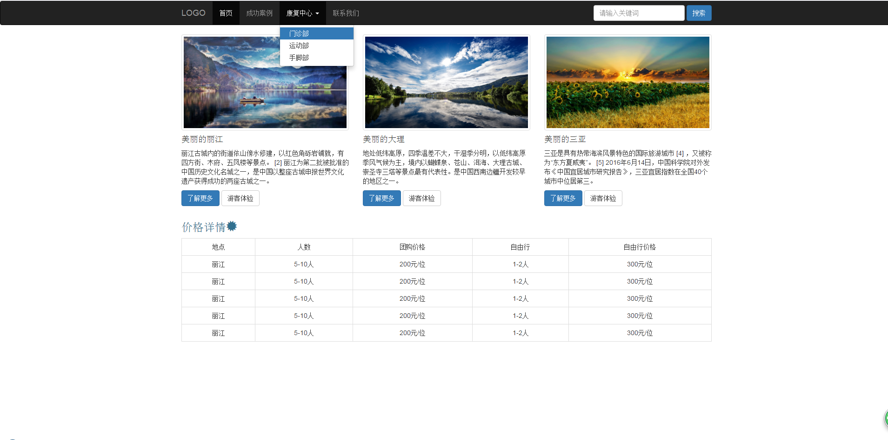

# Bootstrap

# 1. 简介

Bootstrap 是一套用于 HTML、CSS 和 JS 开发的开源工具集。能够快速开发界面。

# 2. 下载Bootstrap

- 英文官网：http://getbootstrap.com
- 中文官网：http://www.bootcss.com/
- 下载的版本: 3.3.7 
- 下载基于中间的:Bootstrap 源码
  - 在dist目录下有如下三个目录
    - js
    - css
    - font

# 3. 起步

- 参文档中起步

```html
<!DOCTYPE html>
<html lang="zh-CN">
<head>
    <meta charset="utf-8">
    <!--如果使用的是IE，就用最IE11引擎-->
    <meta http-equiv="X-UA-Compatible" content="IE=edge">
    <!--视口:适配各种终端-->
    <meta name="viewport" content="width=device-width, initial-scale=1">
    <title>起步</title>

    <!-- Bootstrap css -->
    <link href="third/bootstrap/css/bootstrap.css" rel="stylesheet">

    <!-- HTML5 shim 和 Respond.js 是为了让 IE8 支持 HTML5 元素和媒体查询（media queries）功能 -->
    <!-- 警告：通过 file:// 协议（就是直接将 html 页面拖拽到浏览器中）访问页面时 Respond.js 不起作用 -->
    <!--[if lt IE 9]>
    <script src="https://cdn.jsdelivr.net/npm/html5shiv@3.7.3/dist/html5shiv.min.js"></script>
    <script src="https://cdn.jsdelivr.net/npm/respond.js@1.4.2/dest/respond.min.js"></script>
    <![endif]-->
</head>
<body>
<h1>你好，世界！</h1>


<!-- jQuery (Bootstrap 的所有 JavaScript 插件都依赖 jQuery，所以必须放在前边) -->
<script src="third/jquery/jquery-3.3.1.js"></script>
<!-- 加载 Bootstrap 的所有 JavaScript 插件。你也可以根据需要只加载单个插件。 -->
<script src="third/bootstrap/js/bootstrap.js"></script>
</body>
</html>
```

# 4. 全局CSS新式

## 4.1.  布局容器

- container  : 版心容器
- container-fluid : 全宽容器

```html
<!--版心-->
<div class="container">
    <h2>hello world</h2>
</div>
<!-- 全宽-->
<div class="container-fluid">
    <h2>hello world</h2>
</div>
```

## 4.2.  栅格系统

- ## 栅格参数

  - 大屏(col-lg-*): >=1200px
  - 中屏(col-md-*): >=992px
  - 小屏col-sm-*: >=768px
  - 超小屏col-xs-*:<758px

```html
<!DOCTYPE html>
<html lang="zh-CN">
<head>
    <meta charset="utf-8">
    <meta http-equiv="X-UA-Compatible" content="IE=edge">
    <meta name="viewport" content="width=device-width, initial-scale=1">
    <title>栅格</title>
    <link href="third/bootstrap/css/bootstrap.css" rel="stylesheet">

    <style>
        .col1{
            background-color: red;
        }
        .col2{
            background-color: green;
        }
        .col3{
            background-color: blue;
        }
        .col4{
            background-color: pink;
        }
    </style>

</head>
<body>
<div class="container">
    <!--默认是4行-->
    <div class="row">
        <div class="col1">col1</div>
        <div class="col2">col2</div>
        <div class="col3">col3</div>
        <div class="col4">col4</div>
    </div>
    <hr>
    <!--行一共12列，第列大小均占3列-->
    <div class="row">
        <div class="col1 col-md-2">col1</div>
        <div class="col2 col-md-3">col2</div>
        <div class="col3 col-md-3">col3</div>
        <div class="col4 col-md-4">col4</div>
    </div>
    <hr>
    <!--列大小不要超过12，但可不平均-->
    <div class="row">
        <div class="col1 col-md-2">col1</div>
        <div class="col2 col-md-3">col2</div>
        <div class="col3 col-md-3">col3</div>
        <div class="col4 col-md-4">col4</div>
    </div>
    <hr>
    <!--列大小超过12，则换行显示-->
    <div class="row">
        <div class="col1 col-md-2">col1</div>
        <div class="col2 col-md-3">col2</div>
        <div class="col3 col-md-3">col3</div>
        <div class="col4 col-md-5">col4</div>
    </div>
    <hr>
    <!--二行四列-->
    <div class="row">
        <div class="col1 col-md-3">col1</div>
        <div class="col2 col-md-3">col2</div>
        <div class="col3 col-md-3">col3</div>
        <div class="col4 col-md-3">col4</div>
        <div class="col1 col-md-3">col1</div>
        <div class="col2 col-md-3">col2</div>
        <div class="col3 col-md-3">col3</div>
        <div class="col4 col-md-3">col4</div>
    </div> <hr>
    <!--大尺寸的会继承小尺寸的，但小尺寸未设置则仍然是默认值-->
    <div class="row">
        <div class="col1 col-xs-3">col1</div>
        <div class="col2 col-xs-3">col2</div>
        <div class="col3 col-xs-3">col3</div>
        <div class="col4 col-xs-3">col4</div>
        <div class="col1 col-xs-3">col1</div>
        <div class="col2 col-xs-3">col2</div>
        <div class="col3 col-xs-3">col3</div>
        <div class="col4 col-xs-3">col4</div>
    </div>
</div>
<script src="third/jquery/jquery-3.3.1.js"></script>
<script src="third/bootstrap/js/bootstrap.js"></script>
</body>
</html>
```

## 4.3. 列偏移、列排序、列嵌套 

- 列偏移:后面都跟着移，只能往右，不能往左

```html
col-md-offset-*
```

- 列排序：后面的不动

  ```html
  col-md-push-*  往右推
  col-md-pull-*  往左啦
  ```

- 列嵌套：是在列中再加上加div行，再写列，些时列又有12列

```html
 <!--列排序-->
    <div class="row">
        <div class="col1 col-md-1 col-md-push-1">col1</div>
        <div class="col2 col-md-2">col2</div>
        <div class="col3 col-md-3">col3</div>
        <div class="col4 col-md-4">col4</div>
    </div>
    <div class="row">
        <div class="col1 col-md-1 col-md-pull-1">col1</div>
        <div class="col2 col-md-2">col2</div>
        <div class="col3 col-md-3">col3</div>
        <div class="col4 col-md-4">col4</div>
    </div>

    <!--列嵌套-->
    <div class="row">
        <div class="col1 col-md-3 ">col1</div>
        <div class="col2 col-md-3">col2</div>
        <div class="col3 col-md-3">col3</div>
        <div class="col4 col-md-3">
            <div class="row">
                <div class="col1 col-md-4">col1</div>
                <div class="col2  col-md-4">col2</div>
                <div class="col3  col-md-4">col3</div>
            </div>
        </div>
    </div>
```


## 4.4. 表格

- table 		:  boostrap表格

- table-bordered  : 加上边框

- table-striped   ： 隔行变色

- table-hover  ： 悬停在行上颜色变深

- table-responsive ： 响应式表单

- table-condensed ： 紧缩显示
- 状态
  - success ： 绿色
  - danger ： 红色
  - warning ： 黄色
  - info  ： 蓝色

```html
<!DOCTYPE html>
<html lang="zh-CN">
<head>
    <meta charset="utf-8">
    <meta http-equiv="X-UA-Compatible" content="IE=edge">
    <meta name="viewport" content="width=device-width, initial-scale=1">
    <title>表格</title>
    <link href="third/bootstrap/css/bootstrap.css" rel="stylesheet">

</head>
<body>

<div class="container">
    <table  class="table table-bordered table-striped  table-hover table-responsive table-condensed">
        <theader>
            <tr>
                <th>学号</th>
                <th>姓名</th>
                <th>年龄</th>
                <th>性别</th>
                <th>地址</th>
            </tr>
        </theader>
        <tbody>
        <tr class="success">
            <td>1</td>
            <td>1</td>
            <td>1</td>
            <td>1</td>
            <td>1</td>
        </tr>
        <tr class="danger">
            <td>2</td>
            <td>2</td>
            <td>2</td>
            <td>2</td>
            <td>2</td>
        </tr>
        <tr class="warning">
            <td>3</td>
            <td>3</td>
            <td>3</td>
            <td>3</td>
            <td>3</td>
        </tr>
        <tr class="info">
            <td>4</td>
            <td>4</td>
            <td>4</td>
            <td>4</td>
            <td>4</td>
        </tr>
        </tbody>
    </table>
</div>

<script src="third/jquery/jquery-3.3.1.js"></script>
<script src="third/bootstrap/js/bootstrap.js"></script>
</body>
</html>
```

## 4.5. 表单

### 4.5.1. 表单有三种形式

- 普通表单： form
- 内联表单 :  form-inline
- 水平表单  : form-horizontal

```html
<h2>基本表单</h2>
    <form action="">
        <div class="form-group">
            <label for="uname">用户名</label>
            <input type="text" id="uname" name="uname" class="form-control" placeholder="请输入用户名">
        </div>

        <div class="form-group">
            <label for="upass">密码</label>
            <input type="password" id="upass" name="upass" class="form-control" placeholder="请输入密码">
        </div>
    </form>
    <hr>

    <h2>内联表单</h2>
    <form action="" class="form-inline">
        <div class="form-group">
            <label for="uname">用户名</label>
            <input type="text" id="uname" name="uname" class="form-control" placeholder="请输入用户名">
        </div>

        <div class="form-group">
            <label for="upass">密码</label>
            <input type="password" id="upass" name="upass" class="form-control" placeholder="请输入密码">
        </div>
    </form>
    <hr>

    <h2>水平排列的表单</h2>
    <form action="" class="form-horizontal">
        <div class="form-group">
            <label for="uname" class="col-sm-2">用户名</label>
            <div class="col-sm-6">
                <input type="text" id="uname" name="uname" class="form-control  " placeholder="请输入用户名">
            </div>
        </div>

        <div class="form-group">
            <label for="upass" class="col-sm-2">密码</label>
            <div class="col-sm-6">
                <input type="password" id="upass" name="upass" class="form-control " placeholder="请输入密码">
            </div>
        </div>
    </form>
    <hr>
```

### 4.5.2. 表单元素

- text
- password
- radio
- checkbox
- 控件前后加文字内容 input-group-addon
- 控件前后加按钮 input-group-btn
- 控件内加图标  form-control-feedback  + hasfeddback(父容器)
- 状态 
  - has-success
  - has-error
  - has-warning
- 大尺寸
  - input-lg

```html
<!DOCTYPE html>
<html lang="zh-CN">
<head>
    <meta charset="utf-8">
    <meta http-equiv="X-UA-Compatible" content="IE=edge">
    <meta name="viewport" content="width=device-width, initial-scale=1">
    <title>表单</title>
    <link href="third/bootstrap/css/bootstrap.css" rel="stylesheet">

</head>
<body>
<div class="container">
    
    <h2>表单元素</h2>
    <form action="">
        <div class="form-group">
            <label for="uname">用户名</label>
            <input type="text" id="uname" name="uname" class="form-control input-lg" placeholder="请输入用户名">
        </div>

        <div class="form-group">
            <label for="upass">密码</label>
            <input type="password" id="upass" name="upass" class="form-control" placeholder="请输入密码">
        </div>

        <div class="form-group">
            <label for="gender">性别</label>
            <input type="radio" class="radio radio-inline" id="gender" name="gender" value="male">男
            <input type="radio" class="radio radio-inline" name="gender" value="female">女
        </div>

        <div class="form-group">
            <label for="upass">爱好</label>
            <input type="checkbox" class="checkbox checkbox-inline" id="hobby" name="hobby" value="travel">旅游
            <input type="checkbox" class="checkbox checkbox-inline" name="hobby" value="swim">游泳
            <input type="checkbox" class="checkbox checkbox-inline" name="hobby" value="reading">读书
            <input type="checkbox" class="checkbox checkbox-inline" name="hobby" value="music">音乐
        </div>

        <div class="form-group">
            <label for="birthyear">出生年份</label>
            <select name="birthyear" id="birthyear" class="form-control">
                <option value="1">1</option>
                <option value="1">1</option>
                <option value="1">1</option>
                <option value="1">1</option>
            </select>
        </div>

        <!--控件前后加文字内容 input-group-addon-->
        <div class="form-group">
            <label for="email">邮箱</label>
            <div class="input-group">
                <input type="text" id="email" name="email" class="form-control">
                <i class="input-group-addon">@wanho.net</i>
            </div>
        </div>

        <div class="form-group has-warning">
            <label for="money">金额</label>
            <div class="input-group">
                <span class="input-group-addon">￥</span>
                <input type="text" name="money" id="money" class="form-control">
            </div>
        </div>

        <!--控件后加按钮 input-group-addon-->
        <div class="form-group">
            <label for="email">邮箱</label>
            <div class="input-group">
                <input type="text" id="email" name="email" class="form-control">
                <span class="input-group-btn">
                    <button class="btn btn-default">确认</button>
                </span>
            </div>
        </div>


        <!--控件前后外部加图标 input-group-addon-->
        <div class="form-group has-error">
            <label for="email">邮箱</label>
            <div class="input-group">
                <input type="text" id="email" name="email" class="form-control">
                <span class="input-group-addon">
                     <i class=" glyphicon glyphicon-ok"></i>
                    </span>
            </div>
        </div>

        <!--控件前后内部加图标 input-group-addon-->
        <div class="form-group has-feedback has-success ">
            <label for="email">邮箱</label>
            <input type="text" id="email" name="email" class="form-control input-lg">
            <i class="glyphicon glyphicon-ok form-control-feedback"></i>
        </div>


    </form>
    <hr>
</div>

<script src="third/jquery/jquery-3.3.1.js"></script>
<script src="third/bootstrap/js/bootstrap.js"></script>
</body>
</html>
```

## 4.6. 按钮

-  可作按钮的元素
  - `<a>`
  - `<button>`
  - `<input>`
- 颜色状态
  - btn-default	: 白
  - btn-primary ： 深蓝色
  - btn-success  ： 绿色
  - btn-danger   ： 红色
  - btn-waring    ： 黄色
  - btn-info         ： 天蓝色
  	 btn-link : 	白

```html
<!DOCTYPE html>
<html lang="zh-CN">
<head>
    <meta charset="utf-8">
    <meta http-equiv="X-UA-Compatible" content="IE=edge">
    <meta name="viewport" content="width=device-width, initial-scale=1">
    <title>按钮</title>
    <link href="third/bootstrap/css/bootstrap.css" rel="stylesheet">

</head>
<body>

   <div class="container">
       <i class="btn btn-default">按钮1</i>
       <button class="btn btn-default">按钮2</button>
       <input type="button" value="按钮3" class="btn btn-default">
       <hr>
       <button class="btn btn-default btn-sm">001</button>
       <button class="btn btn-primary">002</button>
       <button class="btn btn-success btn-lg">003</button>
       <button class="btn btn-danger">004</button>
       <button class="btn btn-warning">005</button>
       <button class="btn btn-info" disabled>006</button>
       <button class="btn btn-link">006</button>

   </div>
<script src="third/jquery/jquery-3.3.1.js"></script>
<script src="third/bootstrap/js/bootstrap.js"></script>
</body>
</html>
```

## 4.7. 图片

- 响应式图片：img-responsive
- 图片外观
  - img-circle		椭圆的
  - img-rounded         圆角
  - img-thumbnail      边框圆
- 图片居中
  - center-block       元素居中相当于margin:0 auto
  - text-block           内容居中，相当 于text-align=center，这里不能用 

```html
<!DOCTYPE html>
<html lang="zh-CN">
<head>
    <meta charset="utf-8">
    <meta http-equiv="X-UA-Compatible" content="IE=edge">
    <meta name="viewport" content="width=device-width, initial-scale=1">
    <title>图片</title>
    <link href="third/bootstrap/css/bootstrap.css" rel="stylesheet">

</head>
<body>


<hr>


<hr>
<div class="text-center center-block" style="width: 60%;border: 1px solid red">aaaa</div>
<script src="third/jquery/jquery-3.3.1.js"></script>
<script src="third/bootstrap/js/bootstrap.js"></script>
</body>
</html>
```

## 4.8. 辅助类

- 文本颜色  text-
- 背景色 bg-

- 关闭按钮  `&times;`
- 三角符号 `&caret;`
- 浮动  pull-left  pull-right
- 内容居中 text-center
- 元素居中 center-block
- 隐藏 sr-only
- 响应工具
  - 显示
    - visiable-xx-block|in-line
  - 隐藏
    - hidden-xx

```html
<!DOCTYPE html>
<html lang="zh-CN">
<head>
    <meta charset="utf-8">
    <meta http-equiv="X-UA-Compatible" content="IE=edge">
    <meta name="viewport" content="width=device-width, initial-scale=1">
    <title>辅助类</title>
    <link href="third/bootstrap/css/bootstrap.css" rel="stylesheet">

</head>
<body>
<h2>文本颜色</h2>
<p class="text-success">001</p>
<p class="text-danger">002</p>
<p class="text-primary">003</p>
<p class="text-info">004</p>
<p class="text-warning">005</p>
<p class="text-muted">006</p>
<hr>

<h2>背景色</h2>
<p class="bg-success">001</p>
<p class="bg-primary">002</p>
<p class="bg-danger">003</p>
<p class="bg-warning">004</p>
<hr>

<h2>关闭按钮</h2>
<button class="btn btn-primary btn-lg">&times;</button>
<hr>

<h2>三角符号</h2>
<i class="caret"></i>
<hr>

<h2>浮动</h2>
<div class="pull-left">001</div>
<div class="pull-left">002</div>
<div class="pull-right">003</div>
<hr>

<h2>内容居中</h2>
<div class="text-center">我是内容</div>
<hr>

<h2>元素居中</h2>
<div class="text-center center-block" style="width: 60%;border: 1px solid red">aaaa</div>
<hr>

<h2>隐藏</h2>
<div class="sr-only"> 我是一个秘密</div>

<h2>响应工具</h2>
<div class="visible-lg-inline">show</div><div class="visible-lg-inline">show</div>
<div class="hidden-lg">hidden</div>
<script src="third/jquery/jquery-3.3.1.js"></script>
<script src="third/bootstrap/js/bootstrap.js"></script>
</body>
</html>
```

# 5. 组件

## 5.1.  图标

- 能放图标的元素
  - span
  - i

```html
<!DOCTYPE html>
<html lang="zh-CN">
<head>
    <meta charset="utf-8">
    <meta http-equiv="X-UA-Compatible" content="IE=edge">
    <meta name="viewport" content="width=device-width, initial-scale=1">
    <title>图标</title>
    <link href="third/bootstrap/css/bootstrap.css" rel="stylesheet">

</head>
<body>

   <div class="container">
       <i class="glyphicon glyphicon-zoom-in"></i>
       <span class="glyphicon glyphicon-zoom-out"></span>
       <button class="btn btn-primary">
          购物车 <i class="glyphicon glyphicon-shopping-cart"></i>
       </button>
   </div>

<script src="third/jquery/jquery-3.3.1.js"></script>
<script src="third/bootstrap/js/bootstrap.js"></script>
</body>
</html>
```

## 5.2.  下拉菜单

- 容器 dropdown
- 按钮 data-toggle="dropdown"
- 菜单  dropdown-menu
- 菜单 li>a

```html
<!DOCTYPE html>
<html lang="zh-CN">
<head>
    <meta charset="utf-8">
    <meta http-equiv="X-UA-Compatible" content="IE=edge">
    <meta name="viewport" content="width=device-width, initial-scale=1">
    <title>下拉菜单</title>
    <link href="third/bootstrap/css/bootstrap.css" rel="stylesheet">

</head>
<body>
<div class="container">


    <h2>下拉菜单</h2>
    <div class="dropdown">
        <button class="btn btn-primary" data-toggle="dropdown">下拉菜单 <i class="caret"></i> </button>
        <ul class="dropdown-menu">
            <li><a href="#">001</a></li>
            <li><a href="#">002</a></li>
            <li><a href="#">003</a></li>
            <li><a href="#">004</a></li>
        </ul>
    </div>
    <hr>

    <h2>上拉菜单</h2>
    <div class="dropup">
        <button class="btn btn-primary" data-toggle="dropdown">下拉菜单 <i class="caret"></i> </button>
        <ul class="dropdown-menu">
            <li><a href="#">001</a></li>
            <li><a href="#">002</a></li>
            <li><a href="#">003</a></li>
            <li><a href="#">004</a></li>
        </ul>
    </div>
    <hr>

    <h2>下拉菜单-菜单右对齐</h2>
    <div class="dropdown">
        <button class="btn btn-primary" data-toggle="dropdown">下拉菜单 <i class="caret"></i> </button>
        <ul class="dropdown-menu dropdown-menu-right">
            <li><a href="#">001</a></li>
            <li><a href="#">002</a></li>
            <li><a href="#">003</a></li>
            <li><a href="#">004</a></li>
        </ul>
    </div>
    <hr>

    <h2>下拉菜单-菜单分隔线</h2>
    <div class="dropdown">
        <button class="btn btn-primary" data-toggle="dropdown">下拉菜单 <i class="caret"></i> </button>
        <ul class="dropdown-menu">
            <li><a href="#">001</a></li>
            <li><a href="#">002</a></li>
            <li class="divider"></li>
            <li><a href="#">003</a></li>
            <li><a href="#">004</a></li>
        </ul>
    </div>
    <hr>

</div>

<script src="third/jquery/jquery-3.3.1.js"></script>
<script src="third/bootstrap/js/bootstrap.js"></script>
</body>
</html>
```


## 5.3.  按钮组

- 多个按钮拼在一起，要加上btn-group
- 结合按钮组实现分裂式下拉菜单

```html
<!DOCTYPE html>
<html lang="zh-CN">
<head>
    <meta charset="utf-8">
    <meta http-equiv="X-UA-Compatible" content="IE=edge">
    <meta name="viewport" content="width=device-width, initial-scale=1">
    <title>按钮组</title>
    <link href="third/bootstrap/css/bootstrap.css" rel="stylesheet">

</head>
<body>

<div class="container">
    <h2>按钮组</h2>
    <div class="btn-group">
        <button class="btn btn-primary btn-lg">btn1</button>
        <button class="btn btn-primary btn-sm">btn2</button>
        <button class="btn btn-primary">btn3</button>
    </div>
    <hr>

    <h2>按钮式下拉菜单</h2>
    <div class="dropdown">
        <button class="btn btn-primary" data-toggle="dropdown" >下拉菜单 <i class="caret"> </i></button>
        <ul class="dropdown-menu">
            <li><a href="#">001</a></li>
            <li><a href="#">002</a></li>
            <li><a href="#">003</a></li>
            <li><a href="#">004</a></li>
        </ul>
    </div>

    <hr>

    <h2>分裂式下拉菜单</h2>
    <div class="dropdown">
        <div class="btn-group">
            <button class="btn btn-primary" >下拉菜单 </button>
            <button class="btn btn-primary" data-toggle="dropdown" >
                <i class="caret"></i>
            </button>
            <ul class="dropdown-menu">
                <li><a href="#">001</a></li>
                <li><a href="#">002</a></li>
                <li><a href="#">003</a></li>
                <li><a href="#">004</a></li>
            </ul>
        </div>

    </div>

</div>

<script src="third/jquery/jquery-3.3.1.js"></script>
<script src="third/bootstrap/js/bootstrap.js"></script>
</body>
</html>
```

## 5.4.  输入框

- 基本使用
- 额外文本-外部
- 额外图标-内部
- 额外-按钮
- 额外-下拉菜单
- 额外-分裂下拉菜单

```html
<!DOCTYPE html>
<html lang="zh-CN">
<head>
    <meta charset="utf-8">
    <meta http-equiv="X-UA-Compatible" content="IE=edge">
    <meta name="viewport" content="width=device-width, initial-scale=1">
    <title>输入框</title>
    <link href="third/bootstrap/css/bootstrap.css" rel="stylesheet">

</head>
<body>

<div class="container">
    <h2>基本使用</h2>
    <div class="form-group">
        <label for="uname">用户名</label>
        <input type="text" id="uname" name="uname" class="form-control input-lg" >
    </div>
    <hr>

    <h2>额外文本-外部</h2>
    <div class="form-group">
        <label for="uname">用户名</label>
        <div class="input-group">
            <i class="input-group-addon">RMB</i>
            <input type="text" id="uname" name="uname" class="form-control input-lg" >
            <i class="input-group-addon">@wanho.net</i>
        </div>
    </div>
    <hr>

    <h2>额外图标-内部</h2>
    <div class="form-group has-feedback has-success">
        <label for="uname">用户名</label>
        <input type="text" id="uname" name="uname" class="form-control input-lg " >
        <i class="glyphicon glyphicon-globe form-control-feedback "></i>
    </div>
    <hr>

    <h2>额外下拉框-按钮</h2>
    <div class="form-group has-feedback has-success">
        <label for="uname">用户名</label>
        <div class="input-group input-group-lg">
            <input type="text" id="uname" name="uname" class="form-control  " >
            <div class="input-group-btn   ">
                <button class="btn btn-primary ">按钮</button>
            </div>
        </div>
    </div>
    <hr>

    <h2>额外下拉框-下拉菜单</h2>
    <div class="form-group has-feedback has-success">
        <label for="uname">用户名</label>
        <div class="input-group">
            <input type="text" id="uname" name="uname" class="form-control  " >
            <div class="input-group-btn   ">
                <button class="btn btn-primary " data-toggle="dropdown">下拉按钮 <i class="caret"></i> </button>
                <ul class="dropdown-menu">
                    <li><a href="#">001</a></li>
                    <li><a href="#">002</a></li>
                    <li><a href="#">003</a></li>
                    <li><a href="#">004</a></li>
                </ul>
            </div>

        </div>
    </div>
    <hr>

    <h2>额外下拉框-分裂下拉菜单</h2>
    <div class="form-group has-feedback has-success">
        <label for="uname">用户名</label>
        <div class="input-group">
            <input type="text" id="uname" name="uname" class="form-control  " >
            <div class="input-group-btn ">
                <button class="btn btn-primary " >下拉按钮  </button>
                <button class="btn btn-primary " data-toggle="dropdown">
                    <i class="caret"></i>
                </button>
                <ul class="dropdown-menu">
                    <li><a href="#">001</a></li>
                    <li><a href="#">002</a></li>
                    <li><a href="#">003</a></li>
                    <li><a href="#">004</a></li>
                </ul>
            </div>

        </div>
    </div>
    <hr>
</div>

<script src="third/jquery/jquery-3.3.1.js"></script>
<script src="third/bootstrap/js/bootstrap.js"></script>
</body>
</html>
```

## 5.5.  导航

- 普通导航 nav-tabs
- 胶囊导航 nav-pills

```html
<!DOCTYPE html>
<html lang="zh-CN">
<head>
    <meta charset="utf-8">
    <meta http-equiv="X-UA-Compatible" content="IE=edge">
    <meta name="viewport" content="width=device-width, initial-scale=1">
    <title>导航</title>
    <link href="third/bootstrap/css/bootstrap.css" rel="stylesheet">

</head>
<body>

<div class="container">
    <h2>基本导航</h2>
    <ul class="nav nav-tabs">
        <li class="active"><a href="#">001</a></li>
        <li><a href="#">002</a></li>
        <li><a href="#">003</a></li>
        <li><a href="#">004</a></li>
    </ul>


    <h2>胶囊导航</h2>
    <ul class="nav nav-pills">
        <li ><a href="#">001</a></li>
        <li class="disabled"><a href="#">002</a></li>
        <li><a href="#">003</a></li>
        <li><a href="#">004</a></li>
    </ul>
    <hr>

    <h2>胶囊导航+下拉</h2>
    <ul class="nav nav-pills">
        <li ><a href="#">001</a></li>
        <li class="disabled"><a href="#">002</a></li>
        <li><a href="#">003</a></li>
        <li class="active">
            <a href="#" data-toggle="dropdown">下拉菜单 <i class="caret"></i></a>
            <ul class="dropdown-menu">
                <li><a href="#">001</a></li>
                <li><a href="#">002</a></li>
                <li><a href="#">003</a></li>
            </ul>
        </li>
    </ul>
    <hr>
</div>

<script src="third/jquery/jquery-3.3.1.js"></script>
<script src="third/bootstrap/js/bootstrap.js"></script>
</body>
</html>
```


## 5.6. 导航条

- 导航条: navrbar navbar-default

  - 导航头部
  - 普通导航 nav navbar-nav
  - 表单 navbar-form

- 反序导航条 : navrbar navbar-inverse

- 固定导航条:navbar-fixed-top|bottom


```html
<!DOCTYPE html>
<html lang="zh-CN">
<head>
    <meta charset="utf-8">
    <meta http-equiv="X-UA-Compatible" content="IE=edge">
    <meta name="viewport" content="width=device-width, initial-scale=1">
    <title>导航条</title>
    <link href="third/bootstrap/css/bootstrap.css" rel="stylesheet">

    <style>
        .nav .open > a, .nav .open > a:hover, .nav .open > a:focus{
            border-color:#fff ;
        }
        form button{
            margin-right: 20px;
        }
    </style>

</head>
<body style="height: 2000px">

<div class="container" >
    <!--导航条-->
   <nav class="navbar navbar-default">
       <!--导航头-->
       <div class="navbar-header">
           <a href="#" class="navbar-brand">WANHO</a>
       </div>
       <!--导航-->

       <ul class="nav  navbar-nav">
           <li><a href="#">001</a></li>
           <li><a href="#">002</a></li>
           <li><a href="#">003</a></li>
           <li >
               <a href="#" data-toggle="dropdown">004 <i class="caret"></i> </a>
               <ul class="dropdown-menu">
                   <li><a href="#">001</a></li>
                   <li><a href="#">002</a></li>
                   <li><a href="#">003</a></li>
               </ul>
           </li>
       </ul>

       <form action="" class="navbar-form navbar-right">
           <label for="search" class="sr-only"></label>
           <div class="input-group">
               <input type="text" id="search" name="search" class="form-control">
               <span class="input-group-btn">
                    <button class="btn btn-primary">搜索</button>
               </span>
           </div>

       </form>
   </nav>

    <!--导航条-反序-->
    <nav class="navbar navbar-inverse">
        <!--导航头-->
        <div class="navbar-header">
            <a href="#" class="navbar-brand">WANHO</a>
        </div>
        <!--导航-->

        <ul class="nav navbar-nav">
            <li><a href="#">001</a></li>
            <li><a href="#">002</a></li>
            <li><a href="#">003</a></li>
            <li >
                <a href="#" data-toggle="dropdown">004 <i class="caret"></i> </a>
                <ul class="dropdown-menu">
                    <li><a href="#">001</a></li>
                    <li><a href="#">002</a></li>
                    <li><a href="#">003</a></li>
                </ul>
            </li>
        </ul>

        <form action="" class="navbar-form navbar-right">
            <label for="search" class="sr-only"></label>
            <div class="input-group">
                <input type="text" id="search" name="search" class="form-control">
                <span class="input-group-btn">
                    <button class="btn btn-primary">搜索</button>
               </span>
            </div>

        </form>
    </nav>

    <!--导航条-固定-->
    <nav class="navbar navbar-inverse navbar-fixed-bottom">
        <!--导航头-->
        <div class="navbar-header">
            <a href="#" class="navbar-brand">WANHO</a>
        </div>
        <!--导航-->

        <ul class="nav navbar-nav">
            <li><a href="#">001</a></li>
            <li><a href="#">002</a></li>
            <li><a href="#">003</a></li>
            <li >
                <a href="#" data-toggle="dropdown">004 <i class="caret"></i> </a>
                <ul class="dropdown-menu">
                    <li><a href="#">001</a></li>
                    <li><a href="#">002</a></li>
                    <li><a href="#">003</a></li>
                </ul>
            </li>
        </ul>

        <form action="" class="navbar-form navbar-right">
            <label for="search" class="sr-only"></label>
            <div class="input-group">
                <input type="text" id="search" name="search" class="form-control">
                <span class="input-group-btn">
                    <button class="btn btn-primary">搜索</button>
               </span>
            </div>

        </form>
    </nav>
</div>

<script src="third/jquery/jquery-3.3.1.js"></script>
<script src="third/bootstrap/js/bootstrap.js"></script>
</body>
</html>
```

## 5.7. 路径导航(面包屑) : breadcrumb

```html
<div class="container">
    <ul class="breadcrumb">
        <li><a href="#">首页</a></li>
        <li><a href="#">新闻</a></li>
        <li><a href="#">体育</a></li>
        <li><a href="#">马拉松</a></li>
    </ul>
</div>
```

## 5.8. 分页 : pagination

```html
<div class="container">

    <!--按钮组-->
    <div class="btn-group">
        <button class="btn btn-default">1</button>
        <button class="btn btn-default">2</button>
        <button class="btn btn-default">3</button>
    </div>
    <hr>
    <ul class="pagination pagination-lg">
        <li><a href="#">1</a></li>
        <li><a href="#">2</a></li>
        <li><a href="#">3</a></li>
    </ul>
    <hr>
    <ul class="pager">
        <li class="previous"><a href="#">上一页</a></li>
        <li class="next"><a href="#">下一页</a></li>
    </ul>
</div>
```

## 5.9. 标签 : label

```html
<div class="container">

    <span class="label label-success ">标签1</span>
    <span class="label label-danger">标签1</span>
    <span class="label label-warning">标签1</span>
    <span class="label label-info">标签1</span>
    <span class="label label-primary">标签1</span>

</div>
```

## 5.10.  徽章 : badge

```html
<div class="container">
    <a href="#">未读消息 <span class="badge">4</span> </a>
    <hr>
    <button class="btn btn-primary">未读消息 <span class="badge">4</span> </button>
</div>

```

## 5.11.  巨幕: jumbotron

```html
<div class="container">
    <div class="jumbotron">
        <h2>江苏万和</h2>
        <p>因为有你们更精彩</p>
        <button class="btn btn-primary">感慨</button>
    </div>
</div>
```

## 5.12. 警告框  ： alert

```html
<div class="container">
    <div class="alert alert-success">
        操作成功
        <i class="close">&times;</i>
    </div>
    <div class="alert alert-danger">操作成功</div>
    <div class="alert alert-info">操作成功</div>
    <div class="alert alert-warning">操作成功</div>
</div>
```

## 5.14.  面板 ： panel

```html
<div class="container">
    <div class="panel panel-primary">
        <div class="panel-heading">标题头</div>
        <div class="panel-body">正文</div>
        <div class="panel-footer">脚部</div>
    </div>
</div>
```

# 6. js插件

## 6.1. 模态框 

```html
<!DOCTYPE html>
<html lang="en">
<head>
    <meta charset="UTF-8">
    <title>模态框 </title>
    <link rel="stylesheet" href="third/bootstrap/css/bootstrap.css">
</head>
<body>

<div class="container">
    <button class="btn btn-primary" data-toggle="modal" data-target="#myModal">弹出1</button>
    <hr>
    <a href="#myModal" class="btn btn-success" data-toggle="modal">弹出2</a>
    <hr>
    <button>弹出3(使用js)</button>
</div>

<!--模态框 -->
<div class="modal fade" id="myModal">
    <!--窗体-->
    <div class="modal-dialog">
        <div class="modal-content">
            <div class="modal-header">
                <h2>用户登录 <i class="close"  data-dismiss="modal" >&times;</i> </h2>
            </div>
            <div class="modal-body">
                登录界面
            </div>
            <div class="modal-footer">其它登录方式:关联登录</div>
        </div>
    </div>
</div>


<script src="third/jquery/jquery-3.3.1.js"></script>
<script src="third/bootstrap/js/bootstrap.js"></script>
<script type="text/javascript" language="JavaScript">
    $(function () {
           $("button:last").click(function () {
               $("#myModal").modal();
           });
    });
</script>
</body>
</html>
```

## 6.2. 滚动监听

```html
<!DOCTYPE html>
<html lang="en">
<head>
    <meta charset="UTF-8">
    <title>滚动监听</title>
    <style type="text/css">

        #scroll{
            height: 800px;
            overflow: auto;
        }

        #scroll h2{
            padding-top: 70px;
        }
        #scroll div{
            height: 300px;
        }
    </style>
    <link rel="stylesheet" href="third/bootstrap/css/bootstrap.css">
</head>
<body>

<div class="container">
    <!--导航条-->
    <nav class="navbar navbar-default navbar-fixed-top" id="mynav">
        <div class="navbar-header">
            <div class="navbar-brand">LOGO</div>
        </div>
        <ul class="nav navbar-nav">
            <li class="active"><a href="#a001">001</a></li>
            <li><a href="#a002">002</a></li>
            <li>
                <a href="#"  data-toggle="dropdown"> 下拉菜单  <i class="caret"></i> </a>
                <ul class="dropdown-menu">
                    <li><a href="#a003">003</a></li>
                    <li><a href="#a004">004</a></li>
                    <li><a href="#a005">005</a></li>
                </ul>
            </li>
        </ul>
    </nav>
    <!--<div id="scroll" data-target="#mynav" data-spy="scroll"  >-->
    <div id="scroll"  >
        <h2 id="a001">001</h2>
        <div>001的内容</div>
        <h2  id="a002">002</h2>
        <div>002的内容</div>
        <h2  id="a003">003</h2>
        <div>003的内容</div>
        <h2  id="a004">004</h2>
        <div>004的内容</div>
        <h2  id="a005">005</h2>
        <div>005的内容</div>
    </div>

</div>

<script src="third/jquery/jquery-3.3.1.js"></script>
<script src="third/bootstrap/js/bootstrap.js"></script>
<script type="text/javascript" language="JavaScript">
    $(function(){
        $("#scroll").scrollspy({target:"#mynav"});
    });
</script>
</body>
</html>
```

## 6.3. 选项卡: nav+tab-content>tab-pane

```html
<!DOCTYPE html>
<html lang="en">
<head>
    <meta charset="UTF-8">
    <title>选项卡</title>
    <style type="text/css">
        .tab-content div{
            border: 1px solid cornflowerblue;
            border-top-width: 0px;
        }
    </style>
    <link rel="stylesheet" href="third/bootstrap/css/bootstrap.css">
</head>
<body>

<div class="container">
    <!--导航-->
    <ul class="nav nav-tabs">
        <li ><a id="firstA" href="#a001" data-toggle="tab">001</a></li>
        <li><a href="#a002">002</a></li>
        <li><a href="#a003">003</a></li>
      <li  class="dropdown">
                <a href="#" data-toggle="dropdown">下拉 <i class="caret"></i> </a>
                <ul class="dropdown-menu">
                    <li><a href="#a004">004</a></li>
                    <li><a href="#a005">005</a></li>
                </ul>
        </li>
    </ul>
    <!--选项内容-->
    <div class="tab-content">
        <div id="a001" class="tab-pane fade">001的内容</div>
        <div id="a002" class="tab-pane fade">002的内容</div>
        <div id="a003" class="tab-pane fade">003的内容</div>
        <div id="a004" class="tab-pane fade">004的内容</div>
        <div id="a005" class="tab-pane fade">005的内容</div>
    </div>

</div>

<script src="third/jquery/jquery-3.3.1.js"></script>
<script src="third/bootstrap/js/bootstrap.js"></script>
<script type="text/javascript" language="JavaScript">
    $(function(){
        //模拟触发事件
        $("#firstA").trigger("click");
        $("ul a").click(function (e) {
            e.preventDefault()
            $(this).tab('show');
        });
    });
</script>
</body>
</html>
```

## 6.4. 手风琴式菜单

```html
<!DOCTYPE html>
<html lang="en">
<head>
    <meta charset="UTF-8">
    <title>手风琴式菜单</title>
    <link rel="stylesheet" href="third/bootstrap/css/bootstrap.css">
</head>
<body>

<div class="container">

    <!--<button class="btn btn-primary" data-toggle="collapse" data-target="#content">折叠</button>
    <div id="content" class="collapse">
        这里是内容
    </div>-->

    <div class="panel-group">


        <div class="panel panel-default">
            <div class="panel-heading" >head1</div>
            <div class="panel-body collapse" id="first">
                <p>001</p>
                <p>002</p>
                <p>003</p>
                <p>004</p>
                <p>005</p>
            </div>
        </div>

        <div class="panel panel-default">
            <div class="panel-heading">head2</div>
            <div class="panel-body collapse" id="second">
                <p>001</p>
                <p>002</p>
                <p>003</p>
                <p>004</p>
                <p>005</p>
            </div>
        </div>

        <div class="panel panel-default">
            <div class="panel-heading">head2</div>
            <div class="panel-body collapse  fade">
                <p>001</p>
                <p>002</p>
                <p>003</p>
                <p>004</p>
                <p>005</p>
            </div>
        </div>
    </div>
</div>

<script src="third/jquery/jquery-3.3.1.js"></script>
<script src="third/bootstrap/js/bootstrap.js"></script>
<script type="text/javascript" language="JavaScript">
    /* $(function(){
         $("button").click(function () {
             $("#content").collapse("toggle");
         });
     });*/

    $(function () {
       $(".panel-heading").click(function () {
           //关所有
          $(".collapse").collapse('hide');
          //切换自己状态
           $(this).next().collapse("toggle");
       });
    });
</script>
</body>
</html>
```


## 6.5. 轮播图

 ```html
<!DOCTYPE html>
<html lang="en">
<head>
    <meta charset="UTF-8">
    <title>轮播图</title>
    <link rel="stylesheet" href="third/bootstrap/css/bootstrap.css">
</head>
<body>

<div class="container">
    <h2>轮播图</h2>
    <div class="carousel slide" id="myCarousel" >
        <!--指示器-->
        <ol class="carousel-indicators">
            <li data-target="#myCarousel" class="active" data-slide-to="0"></li>
            <li data-target="#myCarousel" data-slide-to="1"></li>
            <li data-target="#myCarousel" data-slide-to="2"></li>
        </ol>

        <!--内容-->
        <div class="carousel-inner">
            <div class="item active">
                
            </div>
            <div class="item">
                
            </div>
            <div class="item">
                
            </div>
        </div>

        <!--左右方向箭头-->
        <a   href="#myCarousel" class="carousel-control left" data-slide="prev">
            <i class="glyphicon glyphicon-chevron-left"></i>
        </a>
        <a href="#myCarousel" class="carousel-control right" data-slide="next">
            <i class="glyphicon glyphicon-chevron-right"></i>
        </a>
    </div>

</div>

<script src="third/jquery/jquery-3.3.1.js"></script>
<script src="third/bootstrap/js/bootstrap.js"></script>
<script type="text/javascript" language="JavaScript">
    $(function(){
        $("#myCarousel").carousel({ interval: 3000});
    });
</script>
</body>
</html>
 ```

# 7. Bootstrap_Table

- Bootstrap_Table是一个插件，要依赖于Bootstrap，而BootStrap要依赖于jQuery
- Bootstrap_Table可以实现查询、分页、排序、复选框、设置显示列、Card  view视图、主从表显示、合并列、国际化处理等处理功能
- 插件操作有两种方式
  - 基于data-*属性
  - 基本用Javascript方式 【推荐 】

- 显示数据到表格的方式有两种，

  - 客户端（client）模式，第三阶段使用
  - 服务器（server）模式，后面的阶段使用

- 需要引入的 css和js

  ```html
  <!DOCTYPE html>
  <html lang="en">
  <head>
      <meta charset="UTF-8">
      <title>Title</title>
      <!-- 核心 css -->
      <link rel="stylesheet" href="third/bootstrap/css/bootstrap.min.css">
      <link rel="stylesheet" href="third/bootstrap-table/src/bootstrap-table.css">
      <link rel="stylesheet" href="third/bootstrap-editable/bootstrap-editable.css">
  
  
  </head>
  <body>
  
  <!-- 核心 js -->
  <script src="third/jquery/jquery-3.3.1.min.js"></script>
  <script src="third/bootstrap/js/bootstrap.min.js"></script>
  <script src="third/bootstrap-table/src/bootstrap-table.js"></script>
  <script src="third/bootstrap-table/src/extensions/export/bootstrap-table-export.js"></script>
  <script src="third/bootstrap-table/src/extensions/editable/bootstrap-table-editable.js"></script>
  </body>
  </html>
  ```

- data实战

  ```html
  <!DOCTYPE html>
  <html lang="en">
  <head>
      <meta charset="UTF-8">
      <title>Title</title>
      <!-- 核心 css -->
      <link rel="stylesheet" href="third/bootstrap/css/bootstrap.min.css">
      <link rel="stylesheet" href="third/bootstrap-table/src/bootstrap-table.css">
      <link rel="stylesheet" href="third/bootstrap-editable/bootstrap-editable.css">
  
  
  </head>
  <body>
  <div class="container">
      <div id="toolbar">
          <button id="remove" class="btn btn-danger" >
              <i class="glyphicon glyphicon-remove"></i> Delete
          </button>
          <button id="add" class="btn btn-primary" >
              <i class="glyphicon glyphicon-ok"></i> Insert
          </button>
      </div>
  
      <table id="student"
             data-toolbar="#toolbar"
             data-search="true"
             data-show-refresh="true"
             data-show-toggle="true"
             data-show-columns="true"
             data-show-export="true"
             data-detail-view="true"
             data-detail-formatter="detailFormatter"
             data-minimum-count-columns="2"
             data-show-pagination-switch="true"
             data-pagination="true"
             data-id-field="id"
             data-page-size="5"
             data-page-list="[5, 10, 25, 50, 100, ALL]"
             data-show-footer="false"
             data-side-pagination="client"
             data-url="data/student_data.json">
  
  
          <thead>
          <tr>
              <th data-field="state" data-checkbox="true"></th>
              <th data-field="id" data-sortable="true">ID</th>
              <th data-field="name" data-sortable="true">名称</th>
              <th data-field="age" data-sortable="true">年龄</th>
              <th data-field="gender">性别</th>
              <th data-field="address">地址</th>
          </tr>
          </thead>
      </table>
  </div>
  
  <!-- 核心 js -->
  <script src="third/jquery/jquery-3.3.1.min.js"></script>
  <script src="third/bootstrap/js/bootstrap.min.js"></script>
  <script src="third/bootstrap-table/src/bootstrap-table.js"></script>
  <script src="third/bootstrap-table/src/extensions/export/bootstrap-table-export.js"></script>
  <script src="third/bootstrap-table/src/extensions/editable/bootstrap-table-editable.js"></script>
  <script type="text/javascript" language="JavaScript">
      //初始化表格，不要缺少
      $('#student').bootstrapTable();
  </script>
  </body>
  </html>
  ```

- js实践

  ```html
  <!DOCTYPE html>
  <html lang="en">
  <head>
      <meta charset="UTF-8">
      <title>Title</title>
      <!-- 核心 css -->
      <link rel="stylesheet" href="third/bootstrap/css/bootstrap.min.css">
      <link rel="stylesheet" href="third/bootstrap-table/src/bootstrap-table.css">
      <link rel="stylesheet" href="third/bootstrap-editable/bootstrap-editable.css">
  
  
  </head>
  <body>
  <div class="container">
      <div id="toolbar">
          <button id="remove" class="btn btn-danger" >
              <i class="glyphicon glyphicon-remove"></i> Delete
          </button>
          <button id="add" class="btn btn-primary" >
              <i class="glyphicon glyphicon-ok"></i> Insert
          </button>
      </div>
  
      <table id="student"></table>
  </div>
  
  <!-- 核心 js -->
  <script src="third/jquery/jquery-3.3.1.min.js"></script>
  <script src="third/bootstrap/js/bootstrap.min.js"></script>
  <script src="third/bootstrap-table/src/bootstrap-table.js"></script>
  <script src="third/bootstrap-table/src/extensions/export/bootstrap-table-export.js"></script>
  <script src="third/bootstrap-table/src/extensions/editable/bootstrap-table-editable.js"></script>
  <script type="text/javascript" language="JavaScript">
  
  
      //操作事件放置在最前面
      window.operateEvents = {
          'click .find': function (e, value, row, index) {
              alert('You click find action, row: ' + JSON.stringify(row));
          },
          'click .update': function (e, value, row, index) {
              alert('You click update action, row: ' + JSON.stringify(row));
          },
          'click .remove': function (e, value, row, index) {
              $("#student").bootstrapTable('remove', {
                  field: 'id',
                  values: [row.id]
              });
          }
      };
  
      //初始化表格，不要缺少
      $("#student").bootstrapTable({
          url: "data/student_data.json",      //请求后台的URL（*）
          method: 'GET',                      //请求方式（*）
          toolbar: '#toolbar',              //工具按钮用哪个容器
          striped: true,                      //是否显示行间隔色
          cache: false,                       //是否使用缓存，默认为true，所以一般情况下需要设置一下这个属性（*）
          pagination: true,                   //是否显示分页（*）
          showPaginationSwitch: true,         //显示切换分页
          showFooter: true,                    //显示底部，默认不显示
          showFullscreen: false,               //显示全屏
          showHeader: true,                    //显示头部，默认显示
          showExport: true,                    //显示导出
          showColumns: true,                  //是否显示所有的列（选择显示的列）
          showRefresh: true,                  //是否显示刷新按钮
          sortable: true,                     //是否启用排序
          sortOrder: "asc",                   //排序方式
          sidePagination: "client",           //分页方式：client客户端分页，server服务端分页（*）
          pageNumber: 1,                      //初始化加载第一页，默认第一页,并记录
          pageSize: 5,                     //每页的记录行数（*）
          pageList: [5, 10, 15, 20],        //可供选择的每页的行数（*）
          search: true,                      //是否显示表格搜索
          strictSearch: true,
          minimumCountColumns: 2,             //最少允许的列数
          clickToSelect: true,                //是否启用点击选中行
          uniqueId: "id",                     //每一行的唯一标识，一般为主键列
          showToggle: true,                   //是否显示详细视图和列表视图的切换按钮
          cardView: false,                    //是否显示详细视图
          detailView: false,                  //是否显示父子表
          columns: [
              [
                  {
                      field: 'state',
                      checkbox: true,
                      align: 'center',
                      valign: 'middle'
                  },
                  {
                      title: '学号',
                      field: 'id',
                      align: 'center',
                      valign: 'middle',
                      sortable: true
                  },
                  {
                  title: '姓名 ',
                  field: 'name',
  
                  sortable: true,
                  editable: false,
                  align: 'center'
              }, {
                  title: '年龄',
                  field: 'age',
  
                  sortable: true,
                  editable: false,
                  align: 'center'
              }, {
                  title: '性别',
                  field: 'gender',
                  sortable: true,
                  align: 'center'
              }, {
                  title: '操作',
                  field: 'operate',
                  align: 'center',
                 events: operateEvents,
                  formatter: operateFormatter
              }
              ]
          ]
      });
  
  
  
      function operateFormatter(value,row,index) {
          return [
              '<a class="btn btn-primary btn-sm find" href="javascript:void(0)" title="Select">Select',
              '</a>  ',
              '<a class="btn btn-success btn-sm update" href="javascript:void(0)" title="Update">Update',
              '</a> ',
              '<a class="btn btn-danger btn-sm remove" href="javascript:void(0)" title="Remove">Remove',
              '</a>'
          ].join('');
      }
  
      window.operateEvents={};
  
  
  </script>
  </body>
  </html>
  ```


# 8. 作业

实现如下效果图的功能 



```html
<!DOCTYPE html>
<html lang="en">
<head>
    <meta charset="UTF-8">
    <title>bootstrap首页</title>
    <base href="/11_bootstrap/">
    <link rel="stylesheet" href="third/bootstrap/css/bootstrap.css">
    <style type="text/css">
        img {
            width: 350px;
        }
        td{
            text-align: center;
        }
    </style>
</head>
<body>
<nav class="navbar navbar-inverse ">
    <div class="container">
        <!---------------------导航开始------------------------->
        <div class="navbar-header">
            <button type="button" class="navbar-toggle collapsed" data-toggle="collapse" data-target="#navbar-collapse">
                <span class="sr-only">Toggle navigation</span>
                <span class="icon-bar"></span>
                <span class="icon-bar"></span>
                <span class="icon-bar"></span>
            </button>
            <div class="navbar-brand">LOGO</div>
        </div>
        <div class="collapse navbar-collapse" id="navbar-collapse">
            <ul class="nav navbar-nav">
                <li><a href="#">首页</a></li>
                <li><a href="#">成功案例</a></li>
                <li class="dropdown">
                    <a href="#" data-toggle="dropdown">康复中心 <i class="caret"></i></a>
                    <ul class="dropdown-menu">
                        <li class="active"><a href="#">门诊部</a></li>
                        <li><a href="#">运动部</a></li>
                        <li><a href="#">手脚</a></li>
                    </ul>
                </li>
                <li><a href="#">联系我们</a></li>
            </ul>

            <form action="" class="navbar-form navbar-right">
                <input type="text" class="form-control" placeholder="请输入关键字">
                <button class="btn btn-primary">搜索</button>
            </form>
        </div>
        <!---------------------导航结束 ------------------------->
    </div>
</nav>

<div class="container">
    <!---------------------介绍的开始------------------------>
    <div class="row">
        <div class="col-md-4">
            
            <h5>丽江</h5>
            <p>丽江的风景介绍丽江的风景介绍丽江的风景介绍丽江的风景介绍丽江的风景介绍丽江的风景介绍丽江的风景介绍丽江的风景介绍丽江的风景介绍。。。</p>
            <div>
                <button class="btn btn-primary">了解更多</button>
                <button class="btn btn-default">游客体验</button>
            </div>
        </div>
        <div class="col-md-4">
            
            <h5>丽江</h5>
            <p>丽江的风景介绍丽江的风景介绍丽江的风景介绍丽江的风景介绍丽江的风景介绍丽江的风景介绍丽江的风景介绍丽江的风景介绍丽江的风景介绍。。。</p>
            <div>
                <button class="btn btn-primary">了解更多</button>
                <button class="btn btn-default">游客体验</button>
            </div>
        </div>
        <div class="col-md-4">
            
            <h5>丽江</h5>
            <p>丽江的风景介绍丽江的风景介绍丽江的风景介绍丽江的风景介绍丽江的风景介绍丽江的风景介绍丽江的风景介绍丽江的风景介绍丽江的风景介绍。。。</p>
            <div>
                <button class="btn btn-primary">了解更多</button>
                <button class="btn btn-default">游客体验</button>
            </div>
        </div>
    </div>
    <!---------------------介绍的结束------------------------>

    <!---------------------表格的开始------------------------>
    <h3>价格详情 <i class="glyphicon glyphicon-certificate"></i></h3>
    <table class="table table-hover table-responsive table-striped table-bordered">
        <tr>
            <td>001</td>
            <td>002</td>
            <td>003</td>
            <td>004</td>
            <td>005</td>
        </tr>
        <tr>
            <td>001</td>
            <td>002</td>
            <td>003</td>
            <td>004</td>
            <td>005</td>
        </tr>
        <tr>
            <td>001</td>
            <td>002</td>
            <td>003</td>
            <td>004</td>
            <td>005</td>
        </tr>
        <tr>
            <td>001</td>
            <td>002</td>
            <td>003</td>
            <td>004</td>
            <td>005</td>
        </tr>
        <tr>
            <td>001</td>
            <td>002</td>
            <td>003</td>
            <td>004</td>
            <td>005</td>
        </tr>
        <tr>
            <td>001</td>
            <td>002</td>
            <td>003</td>
            <td>004</td>
            <td>005</td>
        </tr>
    </table>
    <!---------------------表格的结束------------------------>
</div>
<script src="third/jquery/jquery-3.3.1.js"></script>
<script src="third/bootstrap/js/bootstrap.js"></script>
<script type="text/javascript" language="JavaScript">
    $("img").addClass("img-thumbnail");
</script>
</body>
</html>
```


